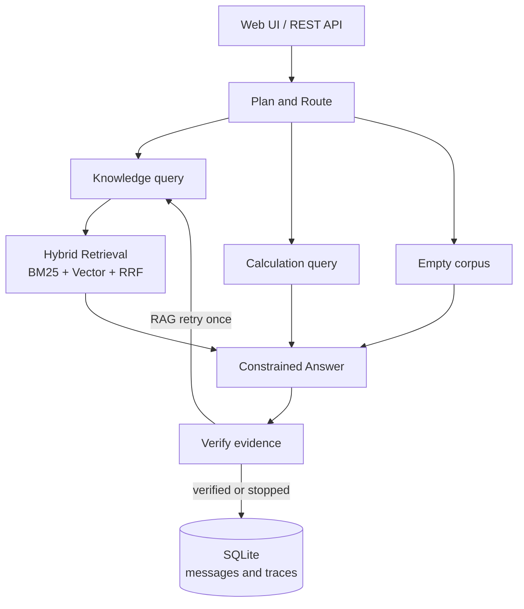

# ResearchFlow Agent

[](https://github.com/francis3253161180-maker/researchflow-agent/actions/workflows/ci.yml)

> 面向科研文档的本地可部署 Agent / RAG 服务：真实文档导入、混合检索、可追溯引用、校验与重试、运行轨迹持久化。

ResearchFlow 不是只调用一次模型的聊天壳。它把文档解析、知识库检索、工具路由、受限回答、引用校验、失败重试和运行记录组合成一个可测试的服务。项目以 **FastAPI + LangGraph + SQLite** 实现；默认可完全离线运行，也可通过 `DEEPSEEK_API_KEY` 启用真实 LLM 生成。

## 为什么做它

科研阅读与实验复盘中的问题往往不是“能否生成一段回答”，而是：回答是否基于已导入的资料、能否返回具体证据、失败时发生在哪个节点、能否在本机复现。ResearchFlow 的 V1 重点覆盖这些工程闭环，而不把小规模离线测试包装成真实业务指标。

## 核心能力

- **文档导入**：支持 PDF、DOCX、Markdown、TXT；PDF 按页解析，Markdown 标题作为分节元数据保存。
- **混合检索**：BM25 风格词法检索与向量相似度检索经 Reciprocal Rank Fusion (RRF) 合并排序。
- **CPU 语义检索**：可选 FastEmbed + `BAAI/bge-small-zh-v1.5`（ONNX Runtime、512 维），不需要 GPU；默认哈希向量便于离线测试与快速启动。
- **LangGraph 编排**：`plan → retrieve / tool → answer → verify → persist`；数学表达式走受限计算工具，知识问答走 RAG。
- **引用校验与重试**：RAG 回答必须有检索证据和 `[1]` 形式的引用标记；缺失时扩展查询并至多重试一次。
- **可观测与会话记忆**：SQLite 持久化文档、分块、会话消息、路由、节点事件、校验状态、脱敏错误类型和延迟；网页可展开查看本次运行轨迹。
- **安全边界**：上传文档被视为不可信证据而非指令；可选 `X-API-Key` 保护 `/api/*`；上传大小受服务端限制。
- **可部署与可验证**：提供网页、OpenAPI、Docker Compose、10 项测试和小型离线回归评测。

## 架构



## 快速开始

```powershell
git clone https://github.com/francis3253161180-maker/researchflow-agent.git
cd researchflow-agent
python -m venv .venv
.\.venv\Scripts\Activate.ps1
python -m pip install -e ".[dev]"
uvicorn app.main:app --reload
```

打开 [http://127.0.0.1:8000](http://127.0.0.1:8000)，或查看 [http://127.0.0.1:8000/docs](http://127.0.0.1:8000/docs)。网页可直接上传文档、删除文档、提问并展示带来源/页码的引用。

### 选择检索与模型后端

复制 `.env.example` 为 `.env`，再按需要配置。应用启动时会读取当前项目目录的 `.env`，但操作系统/容器传入的环境变量优先级更高。不要把 `.env`、密钥或真实私有文档提交到 Git。

```dotenv
# 开发/回归测试：可完全离线
EMBEDDING_PROVIDER=hash

# CPU 语义检索：首次启用时下载模型至 data/models
EMBEDDING_PROVIDER=fastembed
FASTEMBED_MODEL=BAAI/bge-small-zh-v1.5

# 可选：DeepSeek OpenAI-compatible Chat Completions
# 设置后会默认使用 https://api.deepseek.com 与 deepseek-v4-flash
DEEPSEEK_API_KEY=your_key_here

# 可选：保护全部 /api/* 路由
RESEARCHFLOW_APP_API_KEY=choose-a-strong-local-key
```

如果设置了 `RESEARCHFLOW_APP_API_KEY`，调用 API 时需发送 `X-API-Key`。`/health` 保持开放，方便容器健康检查。

### Docker Compose

```powershell
docker compose up --build
```

容器把 SQLite 数据库和 FastEmbed 模型缓存持久化到 `researchflow-data` volume。模型文件会在首次设置 `EMBEDDING_PROVIDER=fastembed` 后下载，不会被硬编码进镜像。
`.dockerignore` 会排除 `.env`、本地数据库、模型缓存、虚拟环境和 Git 元数据，避免它们进入镜像构建上下文。

## API 摘要

| 方法 | 路径 | 作用 |
| --- | --- | --- |
| `POST` | `/api/documents` | 写入粘贴的文本笔记 |
| `POST` | `/api/documents/upload` | 上传 PDF/DOCX/MD/TXT 并解析 |
| `GET` / `DELETE` | `/api/documents` | 查看或删除知识库文档 |
| `POST` | `/api/chat` | 执行一次 Agent 问答 |
| `GET` | `/api/runs/{run_id}` | 回看路由、延迟、节点轨迹和校验状态 |
| `GET` | `/api/metrics` | 查看文档分块、运行次数、平均延迟和校验率 |

## 验证与评测

```powershell
# 单元、接口、上传/删除、元数据与 API key 测试
pytest

# 8 条受控项目能力回归集，默认离线哈希向量
python scripts/run_eval.py --embedding-provider hash

# 同一回归集使用已下载的 CPU 语义向量模型
python scripts/run_eval.py --embedding-provider fastembed
```

当前本机结果：14 项测试全部通过；8 条**受控回归样例**在两种向量后端下均完成检索命中、引用生成和校验（8/8）。GitHub Actions 会在 push/PR 时运行测试并从 Dockerfile 构建镜像。该数据集验证的是项目链路和回归行为，样例内容来自本项目功能说明，**不代表真实企业语料上的准确率、召回率或幻觉率**。后续迭代应以人工标注的公开论文/业务文档评测集补充 Recall@K、nDCG、引用忠实度和失败类型分析。

## 项目结构

```text
app/
  ingestion.py     # PDF/DOCX/MD/TXT 解析及页码/分节元数据
  retrieval.py     # 分块、BM25、向量后端与 RRF
  graph.py         # LangGraph 状态、节点、路由、校验与重试
  llm.py           # 离线回答与 OpenAI-compatible / DeepSeek 调用
  db.py             # SQLite schema、会话与运行轨迹
  main.py           # FastAPI 路由与可选 API key 保护
  static/           # 无构建步骤的网页界面
evals/              # 小型、边界清楚的回归数据
tests/              # 单元和 API 端到端测试
```

想在短时间内真正掌握项目而非只会演示，请按 [学习与面试路径](docs/learning-path.md) 操作。

## 设计取舍与下一步

- V1 使用 SQLite + 应用内向量扫描，适合本地单用户、小规模资料和演示；大规模语料应迁移到专用向量数据库并增加异步任务队列。
- PDF 导入依赖文本层提取；扫描版 PDF、复杂双栏排版或图表中的文字需要在后续接入 OCR/版面解析，而不应被误称为“所有 PDF 均可可靠解析”。
- V1 的检索器已抽象为 provider，可替换为远程 embedding 服务；Reranker 暂未默认启用，避免一开始引入大模型下载、GPU 依赖与不可控延迟。
- LangGraph 负责显式状态流转、条件边和重试；下一阶段可加入持久化 checkpointer、人工审阅中断、检索质量评测与前端流式输出。

## 面试时如何讲这个项目

1. **问题**：普通 RAG demo 缺少证据追溯、失败定位和可重复验证。
2. **方案**：将 Agent 拆成检索/工具路由、引用约束、校验重试和 SQLite 运行轨迹，并以 LangGraph 显式编排。
3. **工程取舍**：默认离线保证测试和演示可复现；可选 FastEmbed 在 CPU 上完成语义检索；真实 LLM 通过环境变量注入，密钥不入库。
4. **证据**：上传、引用页码/分节、API 防护、10 项测试和受控回归评测均有对应代码；后续需要在真实标注语料上补充检索/忠实度指标。

## License

MIT
