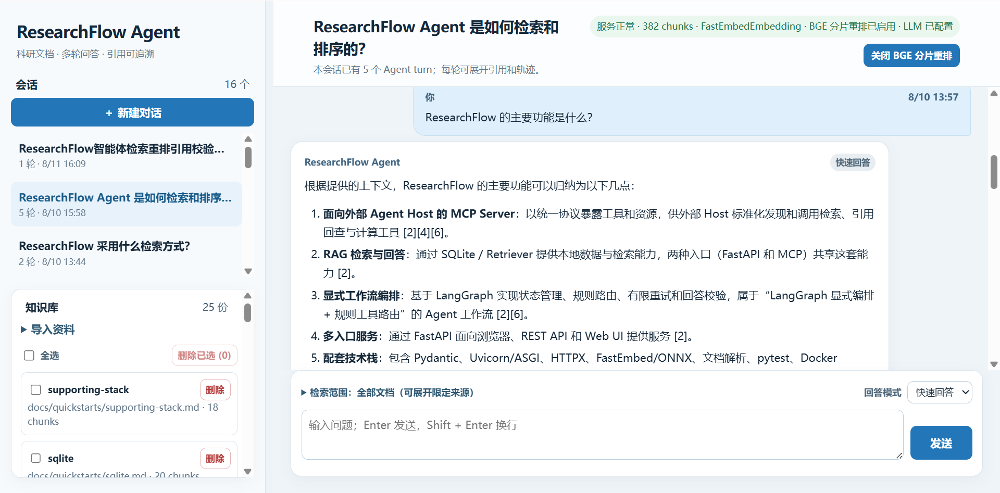
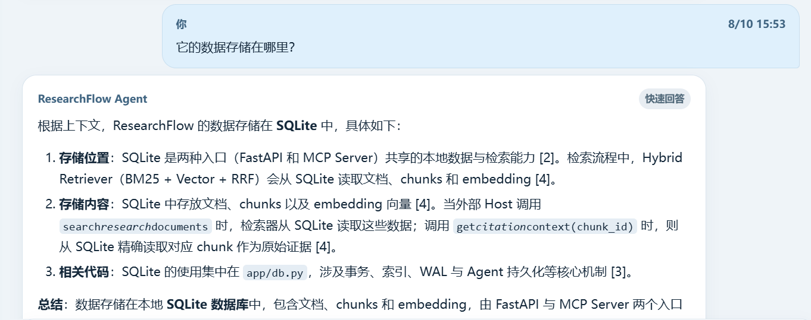
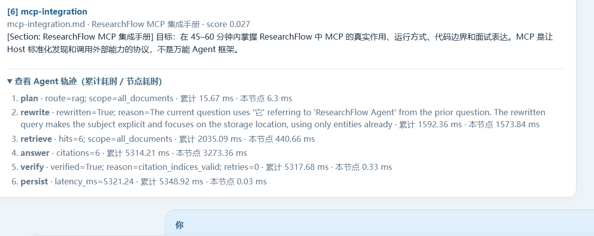
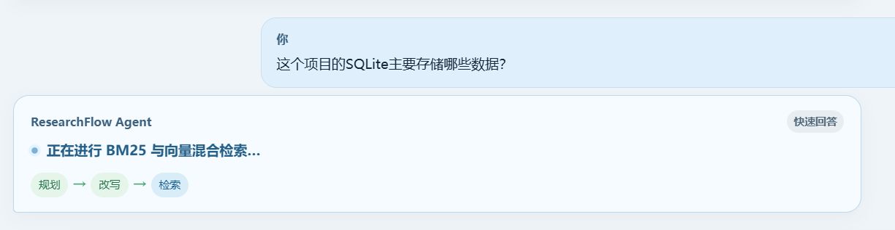
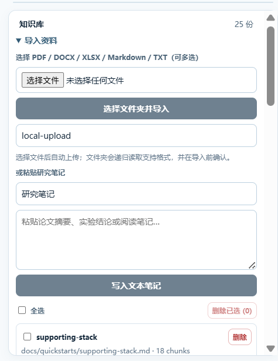
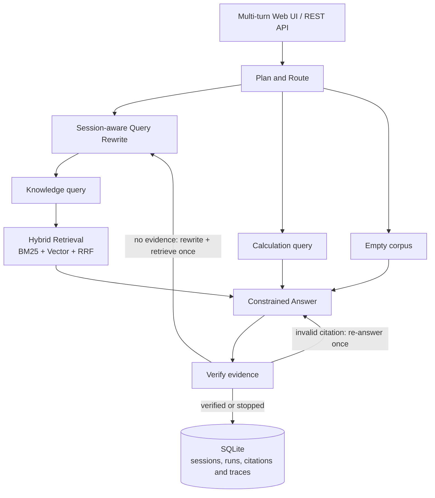

# ResearchFlow Agent

[](https://github.com/francis3253161180-maker/researchflow-agent/actions/workflows/ci.yml)

> 面向科研文档的本地可部署 Agent / RAG 服务：真实文档导入、混合检索、可追溯引用、校验与重试、运行轨迹持久化。

ResearchFlow 不是只调用一次模型的聊天壳。它把文档解析、知识库检索、工具路由、受限回答、引用校验、失败重试和运行记录组合成一个可测试的服务。项目以 **FastAPI + LangGraph + SQLite** 实现；默认可完全离线运行，也可通过 `DEEPSEEK_API_KEY` 启用真实 LLM 生成。

## 为什么做它

科研阅读与实验复盘中的问题往往不是“能否生成一段回答”，而是：回答是否基于已导入的资料、能否返回具体证据、失败时发生在哪个节点、能否在本机复现。ResearchFlow 的 V1 重点覆盖这些工程闭环，而不把小规模离线测试包装成真实业务指标。

## 核心能力

- **文档导入**：支持 PDF、DOCX、XLSX、Markdown、TXT；PDF 按页解析，Markdown 标题与 Excel 工作表/行范围作为分节元数据保存。
- **混合检索**：BM25 风格词法检索与向量相似度检索经 Reciprocal Rank Fusion (RRF) 合并排序。
- **CPU 语义检索**：可选 FastEmbed 多语种 ONNX embedding，不需要 GPU；默认哈希向量便于离线测试与快速启动。
- **LangGraph 编排**：`plan → rewrite → retrieve / tool → answer → verify → persist`；知识问答只利用同一会话最近、已验证的用户 + 助手 turn 消解追问，历史回答不是证据；数学表达式走受限计算工具。
- **结构化引用校验与受控重试**：按 `no_evidence → evidence_not_relevant → citation_missing/citation_out_of_range → citation_indices_valid` 判断；无候选或候选不相关时做一次受控 Rewrite/重检索，引用缺失与越界只在原证据上重答一次。
- **可观测与多轮会话**：SQLite 持久化会话、每轮 run、消息、原始/检索 Query、改写原因、引用、路由、节点事件（累计/节点耗时）、校验状态、回答模式、脱敏错误类型和延迟；网页通过 SSE 实时展示 LangGraph 节点状态，最终回答经校验后一次性提交，并可在回答底部就地展开引用与运行轨迹。
- **安全边界**：上传文档被视为不可信证据而非指令；可选 `X-API-Key` 保护 `/api/*`；上传大小受服务端限制。
- **可部署与可验证**：提供多轮网页、OpenAPI、Docker Compose、61 项测试和多层离线回归评测。

## 界面预览

系统界面展示会话级 Agent 问答、服务与 BGE 分片重排状态、Markdown 回答、可展开的引用证据与运行轨迹。下列截图仅使用项目自身的公开技术文档作为知识库，不包含用户上传的论文或审稿材料。

### 主界面：会话、知识库与运行状态



### 多轮追问：指代消解、改写 Query 与证据引用



### 可解释运行：节点轨迹与流式状态





### 知识库管理：多格式与文件夹导入



> 截图中的 BGE 分片重排运行在 CPU 上，适合质量优先的本地演示；实际延迟取决于模型、候选分片数量和硬件配置。

## 架构



## 快速开始

```powershell
git clone https://github.com/francis3253161180-maker/researchflow-agent.git
cd researchflow-agent
python -m venv .venv
.\.venv\Scripts\Activate.ps1
python -m pip install -e ".[dev]"
uvicorn app.main:app --reload
```

打开 [http://127.0.0.1:8000](http://127.0.0.1:8000)，或查看 [http://127.0.0.1:8000/docs](http://127.0.0.1:8000/docs)。网页可一次多选 PDF / DOCX / XLSX / Markdown / TXT；选择后会自动逐个上传和解析，并汇总成功数、失败原因与分块数。也可以选择一个文件夹：系统会递归导入其中的支持格式、跳过其他文件，并将相对目录保留在来源元数据中。随后可新建或恢复会话，在同一 `session_id` 内连续追问；每轮均保留 Markdown 回答、来源/页码或工作表行范围引用、route 和可展开轨迹。

知识库列表支持“全选 / 取消全选”和“删除已选（N）”；删除前会二次确认。这里的勾选与“检索范围”共用：勾选文档也会将下一轮问答限定在这些文档中。

桌面端可分别拖动侧边栏宽度，以及会话与知识库之间的横向分隔条；两个区域独立滚动，调整比例会保存在本地浏览器中。

在 Windows 上，已完成一次依赖安装后，也可以直接双击项目根目录的 `ResearchFlow.bat` 启动服务。脚本会确认服务健康检查成功后再打开网页，避免首次加载早于后端就绪。

### 选择检索与模型后端

复制 `.env.example` 为 `.env`，再按需要配置。应用启动时会读取当前项目目录的 `.env`，但操作系统/容器传入的环境变量优先级更高。不要把 `.env`、密钥或真实私有文档提交到 Git。

```dotenv
# 开发/回归测试：可完全离线、确定性；不具备语义或中英跨语言检索能力
EMBEDDING_PROVIDER=hash

# CPU 多语种语义检索：首次启用时下载模型至 data/models；适用于中文问题检索英文论文
EMBEDDING_PROVIDER=fastembed
FASTEMBED_MODEL=sentence-transformers/paraphrase-multilingual-MiniLM-L12-v2

# 可选：DeepSeek OpenAI-compatible Chat Completions
# 设置后会默认使用 https://api.deepseek.com 与 deepseek-v4-flash
DEEPSEEK_API_KEY=your_key_here

# DeepSeek V4 默认关闭思考模式，以降低 RAG 问答的延迟。
# 该值是服务默认值；网页可为单轮请求选择快速回答或深度思考，不会修改全局配置。
LLM_THINKING=disabled

# 可选：只对 Hybrid 检索的 Top-N 候选块执行通用 cross-encoder 重排。
# auto：CUDA 时自动加载；CPU 时默认不加载，可在网页顶部手动启动 CPU BGE。
RERANKER_PROVIDER=auto
RERANKER_MODEL=BAAI/bge-reranker-v2-m3
RERANKER_CACHE_DIR=./data/models
RERANKER_DEVICE=auto
RERANKER_CANDIDATES=20

# 可选：保护全部 /api/* 路由
RESEARCHFLOW_APP_API_KEY=choose-a-strong-local-key
```

如果设置了 `RESEARCHFLOW_APP_API_KEY`，调用 API 时需发送 `X-API-Key`。`/health` 保持开放，方便容器健康检查。切换 embedding provider 或模型后，已有文档的向量不能复用：请删除旧文档并重新导入。网页顶栏会显示当前检索后端；出现 `Hash 离线检索（不支持跨语言语义）` 时，不应期待中文问题能稳定命中英文证据。

第二阶段重排有三种明确策略：`auto`（默认，CUDA 自动加载，CPU 由网页顶部按钮按需加载）、`bge`（按 `RERANKER_DEVICE=auto/cpu/cuda` 启动时强制加载）和 `none`（强制关闭）。它仅重排 Hybrid 的 Top-N **候选文本块**，不对整篇文档排序，也不依赖文件类型、标题、reviewer 名称或问题映射。BGE 需要额外安装 `pip install -e ".[rerank]"`；网页状态栏、顶部按钮和 `/health` 都会显示是否实际启用。CPU BGE 会显著增加交互延迟，应只在明确需要更高证据精度时手动启动。

### Docker Compose

```powershell
docker compose up --build
```

容器把 SQLite 数据库和 FastEmbed 模型缓存持久化到 `researchflow-data` volume。模型文件会在首次设置 `EMBEDDING_PROVIDER=fastembed` 后下载，不会被硬编码进镜像。
`.dockerignore` 会排除 `.env`、本地数据库、模型缓存、虚拟环境和 Git 元数据，避免它们进入镜像构建上下文。

## API 摘要

| 方法 | 路径 | 作用 |
| --- | --- | --- |
| `POST` | `/api/documents` | 写入粘贴的文本笔记 |
| `POST` | `/api/documents/upload` | 上传 PDF/DOCX/XLSX/MD/TXT 并解析 |
| `GET` / `DELETE` | `/api/documents` | 查看或删除知识库文档 |
| `POST` | `/api/chat` | 执行一次 Agent 问答 |
| `POST` | `/api/chat/stream` | 以 SSE 推送节点状态；最后一个 `complete` 事件返回与 `/api/chat` 等价的最终结果 |
| `POST` / `GET` | `/api/sessions` | 新建或列出多轮会话 |
| `GET` | `/api/sessions/{session_id}/turns` | 恢复会话中的逐轮问答、引用和轨迹 |
| `GET` | `/api/runs/{run_id}` | 回看路由、延迟、节点轨迹和校验状态 |
| `GET` | `/api/metrics` | 查看文档分块、运行次数、平均延迟和校验率 |

## MCP：向外部 Agent 提供可追溯检索

除 Web UI / REST API 外，ResearchFlow 还提供独立的 **MCP Server**。它通过标准 MCP `stdio` 传输，把本地知识库能力提供给 Claude Desktop、Cursor 或其他支持 MCP 的 Host；MCP 进程与 FastAPI 服务分离，但读取同一份 SQLite 知识库。

- `search_research_documents`：BM25 + 向量检索 + RRF，返回含 `chunk_id`、文档名、页码、章节和原文片段的可追溯结果；
- `get_citation_context`：按 `chunk_id` 精确回查证据，避免二次检索造成引用漂移；
- `calculate_expression`：复用 AST 限制的安全计算工具；
- `researchflow://documents` Resource：列出当前已索引文档及运行统计。

在项目根目录安装依赖后启动：

```powershell
.\.venv\Scripts\python.exe -m app.mcp_server
```

完整的桌面 Host 配置、权限边界、验证步骤与面试表述见 [MCP 集成手册](docs/mcp-integration.md)。MCP 只负责跨进程工具/资源发现与调用；检索链路、引用核验和 LangGraph 编排仍由 ResearchFlow 自身负责。

## 验证与评测

```powershell
# 单元、接口、上传/删除、元数据与 API key 测试
pytest

# 8 条受控项目能力回归集，默认离线哈希向量
python scripts/run_eval.py --embedding-provider hash

# 同一回归集使用已下载的 CPU 语义向量模型
python scripts/run_eval.py --embedding-provider fastembed
```

当前本机结果：61 项测试全部通过；其中包含会话恢复、逐轮 citations、per-run DeepSeek thinking mode、首轮模型标题、只使用已验证对话的 Query Rewrite、无候选或候选不相关时的一次受控重写/检索、引用缺失与编号越界后的差异化同证据重答、PDF 跨页标题栈、DOCX 多级 Heading/表格继承、Verify 优先级、SSE 节点状态与最终结果、MCP `stdio` 客户端与独立 Server 的端到端握手、工具发现和调用。8 条**受控回归样例**在两种向量后端下均完成检索命中、引用生成和校验（8/8）。GitHub Actions 会在 push/PR 时运行测试并从 Dockerfile 构建镜像。该数据集验证的是项目链路和回归行为，样例内容来自本项目功能说明，**不代表真实企业语料上的准确率、召回率或幻觉率**。

### 小规模论文检索评测

新增一套可复现的**文档级检索**评测：4 篇本地提供的公开科研论文、16 条人工标注问题；同一问题分别比较 BM25 风格词法检索、CPU Dense Retrieval 与 Hybrid + RRF。相关论文只是语料来源，ResearchFlow 不复现、也不与其中的 GraphRAG / 多跳方法比较。

```powershell
# 默认从项目父目录读取四篇 PDF；结果会写入 evals/results/
python scripts/run_eval.py --corpus-dir .. --embedding-provider hash
python scripts/run_eval.py --corpus-dir .. --embedding-provider fastembed
```

| 后端 / 策略 | Recall@1 | Recall@2 | MRR@4 | 平均检索延迟 |
| --- | ---: | ---: | ---: | ---: |
| Hash + Lexical | 1.0000 | 1.0000 | 1.0000 | 86.27 ms |
| Hash + Dense | 0.7500 | 0.8750 | 0.8490 | 92.10 ms |
| Hash + Hybrid RRF | 0.8750 | 0.8750 | 0.9167 | 86.96 ms |
| FastEmbed + Lexical | 1.0000 | 1.0000 | 1.0000 | 1077.73 ms |
| FastEmbed + Dense | 0.5000 | 0.7500 | 0.6979 | 1081.76 ms |
| FastEmbed + Hybrid RRF | 0.7500 | 0.9375 | 0.8646 | 1021.29 ms |

这组语料的专有方法名与问题文本高度重合，因此词法检索在 Recall@1 上最优；Hybrid 的价值在于 FastEmbed 条件下提高 Recall@2，代价是 CPU embedding 延迟。该结果说明应按语料分布选择检索策略，不能预设 RRF 一定获胜。完整协议、问题标签、原始结果与失败分析见 [论文检索评测说明](docs/paper-retrieval-evaluation.md)。

另有一份 [本地多语种真实文档评测](docs/portfolio-multilingual-evaluation.md)：它使用用户提供的论文、rebuttal、OpenReview、DOCX 和 PDF 简历，检验中文问题对中英文混合材料的检索边界。该语料不提交到仓库，结果不等同于通用企业 RAG 指标。

在此基础上，[本地真实文档端到端问答评测](docs/portfolio-answer-evaluation.md) 进一步验证“检索 → 生成 → 引用 → 拒答”链路；它明确区分参考要点覆盖、引用编号有效性、证据支撑和拒答正确性，不将检索召回率误称为答案准确率。

## 项目结构

```text
app/
  ingestion.py     # PDF/DOCX/XLSX/MD/TXT 解析及页码/分节元数据
  retrieval.py     # 分块、BM25、向量后端与 RRF
  graph.py         # LangGraph 状态、节点、路由、校验与重试
  llm.py           # 离线回答与 OpenAI-compatible / DeepSeek 调用
  db.py             # SQLite schema、会话与运行轨迹
  main.py           # FastAPI 路由与可选 API key 保护
  mcp_server.py     # 标准 MCP Server：检索、精确引用回查、计算与文档 Resource
  static/           # 无构建步骤的网页界面
evals/              # 小型、边界清楚的回归数据
tests/              # 单元和 API 端到端测试
```

想在短时间内真正掌握项目而非只会演示，请从 [周末学习冲刺](docs/weekend-study-guide.md) 开始，并按 [学习与面试路径](docs/learning-path.md) 操作。

FastAPI、LangGraph、SQLite 与配套框架的核心入门材料统一放在 [快速入门手册](docs/quickstarts/README.md)；需要复盘组件关系时查看 [知识关系图全集](docs/knowledge-maps.md)。
文档导入时如何保留页码、跨页标题栈和 DOCX 结构，请查看[文档结构元数据说明](docs/document-structure-metadata.md)。

## 设计取舍与下一步

- V1 使用 SQLite + 应用内向量扫描，适合本地单用户、小规模资料和演示；大规模语料应迁移到专用向量数据库并增加异步任务队列。
- PDF 导入依赖文本层提取；扫描版 PDF、复杂双栏排版或图表中的文字需要在后续接入 OCR/版面解析，而不应被误称为“所有 PDF 均可可靠解析”。
- XLSX 导入以只读方式序列化工作表行；公式以公式文本保留，不执行公式、宏或外部连接，因此不是电子表格自动化能力。
- V1 的检索器已抽象为 provider，可替换为远程 embedding 服务；Reranker 暂未默认启用，避免一开始引入大模型下载、GPU 依赖与不可控延迟。
- LangGraph 负责显式状态流转、条件边和受控重试；SQLite 的会话/turn 持久化不是图级 checkpointer。当前已有受控 Query Rewrite、逐节点 duration 与检索质量评测；下一阶段可考虑前端流式输出和更严格的语义/忠实度验证。

## 面试时如何讲这个项目

1. **问题**：普通 RAG demo 缺少证据追溯、失败定位和可重复验证。
2. **方案**：将 Agent 拆成检索/工具路由、引用约束、校验重试和 SQLite 运行轨迹，并以 LangGraph 显式编排。
3. **工程取舍**：默认离线保证测试和演示可复现；可选 FastEmbed 在 CPU 上完成语义检索；真实 LLM 通过环境变量注入，密钥不入库。
4. **证据**：上传、引用页码/分节、PDF 跨页标题栈、DOCX 多级 Heading/表格继承、会话恢复、per-run thinking mode、首轮模型标题、可信短期记忆的 Query Rewrite 轨迹、按 Verify 原因分流的检索/生成修复、API 防护、61 项测试、MCP 端到端调用和受控回归评测均有对应代码；后续需要补齐更严格的引用忠实度验证。

## 深入阅读

- [架构、执行流程与设计取舍](docs/architecture-and-decisions.md)：组件职责、LangGraph 状态流、检索链路、验证边界与生产演进路径。
- [学习与面试路径](docs/learning-path.md)：2–3 天动手学习安排和 90 秒项目讲解脚本。
- [周末学习冲刺](docs/weekend-study-guide.md)：周六运行与走读、周日失败案例与修改、周一投递检查。
- [文件地图与精读优先级](docs/file-map.md)：逐文件职责、两天内的 P0/P1/P2 阅读深度与注释原则。
- [快速入门手册](docs/quickstarts/README.md)：FastAPI、LangGraph、SQLite 及配套栈的核心原理、高频题和项目验收。
- [知识关系图全集](docs/knowledge-maps.md)：API、编排、RAG、持久化、LLM、测试部署及算法扩展的组件关系图。
- [Agent 框架与组件边界](docs/framework-boundaries.md)：LangGraph、LangChain、LlamaIndex、MCP、Dify/Coze 与 vLLM 的定位和选型。
- [MCP 集成手册](docs/mcp-integration.md)：MCP Host / Client / Server 边界、实际工具、桌面 Host 配置、测试与高频面试题。
- [代码走读](docs/code-walkthrough.md)：从 FastAPI 请求到 LangGraph、检索、模型、校验和 SQLite 的逐步追踪。
- [Query Rewrite 与结构化验证](docs/query-rewrite-and-verification.md)：多轮追问如何改写、验证实际保证什么，以及可复现测试场景。
- [技术栈核心与高频知识点](docs/technical-stack-handbook.md)：Python、FastAPI、LangGraph、Agent、RAG、检索、数据库、Docker、CI 与测试。
- [高频面试问题](docs/interview-questions.md)：36 个项目追问及边界清楚的回答框架。
- [失败案例与调试](docs/failure-cases-and-debugging.md)：空语料、引用缺失、模型异常、解析、检索、SQLite 与 Docker 排错。
- [动手练习](docs/hands-on-exercises.md)：从补测试到 Reranker、正式评测和存储迁移的分级任务。

## Full-text evaluation boundary

The public SciFact check is intentionally **abstract-level** and therefore does not demonstrate full-paper retrieval. The project separately evaluates long-document evidence retrieval on [QASPER](docs/fulltext-retrieval-evaluation.md), while local PDF/DOCX/XLSX regression checks cover supported-format parsing. These layers measure different things and must not be merged into one generic "accuracy" number.

## License

MIT
