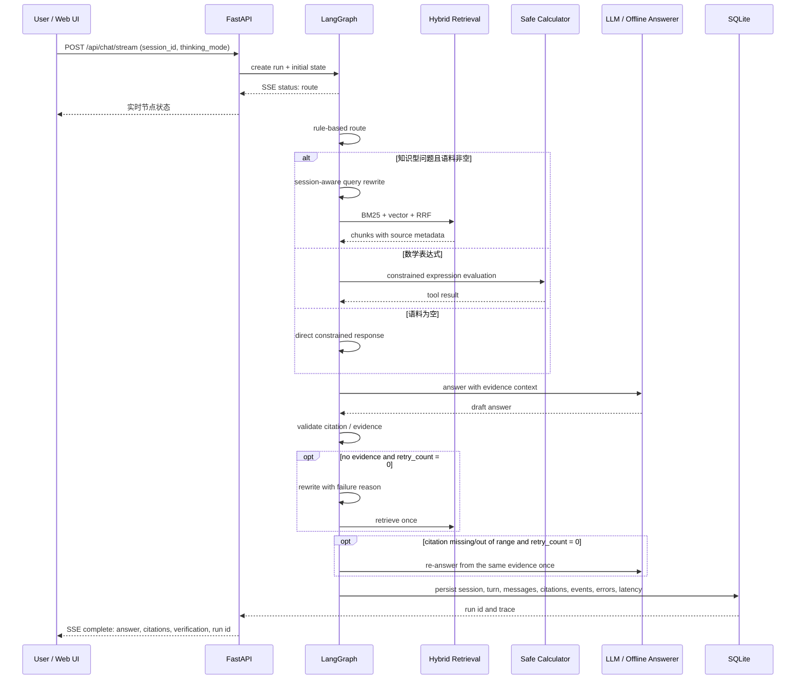
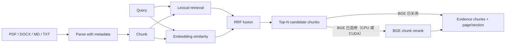

# ResearchFlow Agent：架构、流程与设计取舍

本文用于帮助读者快速理解项目的真实边界、一次请求如何流转，以及为什么 V1 采用当前的工程方案。它不是对项目能力的营销描述；所有结论均可在代码、测试和 GitHub Actions 中复现。

## 1. 解决的问题

科研阅读中的问答系统不能只输出一段流畅的答案，还需要回答三个问题：

1. 回答是否来自已经导入的资料，而非模型凭空补全？
2. 用户能否回到原始文档的页码或 Markdown 小节核查？
3. 回答失败时，开发者能否定位是检索、模型、引用还是工具环节出了问题？

ResearchFlow 将这些要求拆成可观察、可测试的组件：文档解析、混合检索、路由、受限回答、引用校验、有限重试和运行轨迹持久化。

## 2. 组件与职责

| 组件 | 代码位置 | 职责 | 有意不做的事 |
| --- | --- | --- | --- |
| FastAPI | `app/main.py` | 文件上传、聊天、会话/turn 恢复、指标与 run 查询 API；可选 API Key | 不承担复杂业务编排 |
| Ingestion | `app/ingestion.py` | 解析 PDF/DOCX/MD/TXT，保留页码/多级小节元数据 | 不把扫描件 PDF 或 DOCX 渲染页码伪装成可靠原生结构 |
| Retrieval | `app/retrieval.py` | 分块、词法检索、向量检索、RRF 融合 | 不在 V1 引入独立向量数据库 |
| LangGraph | `app/graph.py` | 显式状态流转、条件路由、最多一次检索重试 | 不把每个问题都拆成多 Agent |
| LLM | `app/llm.py` | 离线确定性回答或 OpenAI-compatible / DeepSeek 生成；单轮可覆盖 thinking mode | 不将密钥或内部 reasoning 写进仓库或前端 |
| SQLite | `app/db.py` | 保存文档、分块、会话、turn、消息、引用、事件、错误类型和延迟 | 不作为高并发生产数据库 |
| Web UI | `app/static/` | 会话切换、上传、多轮提问、逐轮来源和可展开轨迹 | 不取代完整运营后台 |

## 3. 一次请求的执行流程

### 关键状态与约束

- `route` 只选择知识检索、计算工具或空语料处理，不让模型任意调用本地能力。
- 知识型回答必须带有检索证据及 `[n]` 引用；校验失败时只允许一次扩展查询，避免无限循环。
- 运行事件、错误类型和延迟写入 SQLite。对外只返回脱敏后的异常类别，避免意外暴露密钥、路径或上游响应内容。
- 一个 `session_id` 是一段对话；一次用户提交及其有限重试对应一个 `run_id`。网页恢复的是同一会话下按时间排序的 runs，不会把不同会话混在一个聊天记录中。
- `thinking_mode` 是单轮生成策略：`disabled` 为快速回答，`enabled` 为 DeepSeek 深度思考；只影响本轮模型生成请求，不改变检索算法，也不展示内部 reasoning。
- 文档内容是**不可信证据**而不是系统指令；它会进入检索上下文，但不应改变系统层行为。

## 4. 检索链路

**BGE 激活策略：** BGE 只位于 RRF 之后，并仅对候选文本块执行 `(query, passage)` 重排；`auto` 在 CUDA 下自动加载、在 CPU 下由用户通过网页顶部按钮按需加载，`bge` 按设备配置在启动时强制加载，`none` 强制关闭。它不会对整篇文档排序。

V1 的词法检索与向量检索各有价值：前者对专业术语、文件名和精确关键词稳定；后者对同义表达更稳健。RRF 只融合排名而非直接比较两个分数的数值尺度，因此适合这个小型、可替换后端的项目。

嵌入后端有两种模式：

- `hash`：默认离线确定性后端，适合测试与快速启动；不代表真实语义效果。
- `fastembed`：CPU 上的 `BAAI/bge-small-zh-v1.5`（ONNX Runtime），适合本地语义检索演示，无 GPU 依赖。

## 5. 为什么使用 LangGraph，而不是低代码工作流

这个项目需要展示路由分支、状态字段、引用失败的重试上限与每个节点的执行轨迹。LangGraph 的 `StateGraph` 将这些状态转移定义在代码中，便于写单元测试和在面试时解释；FastAPI 负责服务边界，二者分工明确。

这不是说低代码工具没有价值：Dify/Coze 适合快速验证业务工作流；当系统需要版本控制、条件边、自动化测试、异常观察和部署时，代码编排更适合作为作品集的主体。

## 6. 已验证的内容与验证边界

- `pytest` 覆盖 61 项单元、API 与 MCP 端到端测试，包括上传/删除、PDF 跨页标题栈、DOCX 多级 Heading/表格继承、页码元数据、结构化引用校验与相关性状态优先级、会话/turn 恢复、per-run thinking mode、只使用已验证 turn 的会话感知 Query Rewrite、SSE 节点状态与最终结果、首轮模型标题、异常脱敏、轨迹持久化以及 stdio 工具发现/调用。
- `scripts/run_eval.py` 有 8 条受控回归样例，并已在 hash 和 FastEmbed 两种后端下跑通检索命中、引用生成与校验。
- GitHub Actions 在 push/PR 时执行测试和 Docker 镜像构建。

上述内容验证的是项目链路的正确性和回归行为，**并不等价于真实企业语料上的检索准确率、召回率或幻觉率**。若进入下一阶段，应选择允许公开的、人工标注的公开语料，报告 Recall@K、nDCG、引用忠实度与失败类型分析。

## 7. 面向生产的演进路径

| 当前 V1 | 触发条件 | 合理的下一步 |
| --- | --- | --- |
| SQLite + 应用内扫描 | 文档量和并发明显增长 | PostgreSQL + pgvector / 专用向量数据库；异步任务队列 |
| 文本层 PDF | 扫描件、复杂双栏和图表成为主要输入 | OCR、版面分析与人工抽样质检 |
| 无 reranker | 公开评测证明 top-K 精度不足 | 先加入可开关 reranker，再用 Recall@K/nDCG 判断收益 |
| 单轮工具路由 | 多步骤研究工作流有真实需求 | 增加受控的规划、checkpointer 与人工审批点 |

重点是由真实瓶颈驱动复杂度，而不是为简历堆叠组件。

## 8. 推荐的代码阅读顺序

1. 从 `app/main.py` 看 API 输入输出与运行入口。
2. 读 `app/graph.py` 的 state、节点与条件边，理解一次 Agent 运行。
3. 读 `app/retrieval.py`，再用 `scripts/run_eval.py` 观察检索与 RRF。
4. 查看 `app/db.py` 和 `/api/runs/{run_id}`，理解可观测性如何落库。
5. 最后看 `tests/`，用测试反推项目真实承诺的行为边界。

更短的 2–3 天动手学习安排见 [learning-path.md](learning-path.md)。
