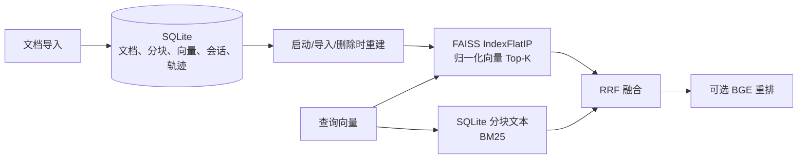
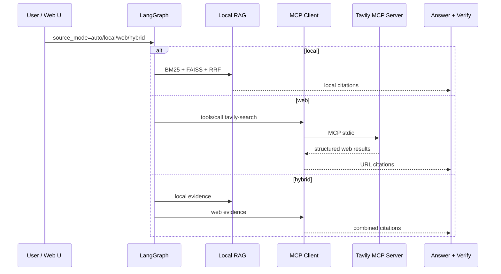

# FAISS 索引与 MCP 网络搜索

本文记录 ResearchFlow 当前的数据分工和外部搜索边界，避免把“使用了 FAISS/MCP”写成没有实现的概念标签。

## 1. SQLite 与 FAISS 的分工



| 组件 | 当前职责 | 为什么这样做 |
| --- | --- | --- |
| SQLite | 唯一持久化真源：文档、原文分块、embedding JSON、页码/章节、会话、run、引用和轨迹 | 单文件、事务和可追溯性适合本地部署 |
| FAISS `IndexFlatIP` | 内存中的归一化向量 Top-K 检索与 row-to-chunk 映射 | 用 C++ 向量检索替代 Python 逐块点积；索引可从 SQLite 安全重建 |
| BM25 | 对全部候选分块计算词法相关性 | 对术语、论文方法名和明确关键词仍有价值 |
| RRF / BGE | 融合词法与语义排名；可选 cross-encoder 对候选块重排 | 不把单一检索器当作必然最优 |

FAISS 不是完整向量数据库：当前 `IndexFlatIP` 是精确内积索引，检索仍会读取 SQLite 中的分块元数据以形成可引用结果。它改善向量检索的计算路径和职责边界，但不把本项目包装成多机、高并发的向量数据库服务。

### 索引一致性

- 服务启动时从 SQLite 重建索引；
- 每次导入完成后重建；
- 删除文档后重建；
- 查询前若 SQLite 分块数与索引大小不一致，会自动重建。

因此，SQLite 损坏或更换 embedding 模型时，FAISS 不会被当作独立事实来源。更换 embedding provider/model 后仍应删除旧文档并重新导入，不能混用不同向量空间。

### 为什么暂不接 Milvus

Milvus 适用于多实例、百万级向量、高并发和独立运维需求；它需要额外服务、集合 schema、索引管理、健康检查、备份与权限设计。ResearchFlow 当前的“本地科研文档、单机可部署、SQLite 会话轨迹”目标下，SQLite + FAISS 的成本和可解释性更匹配。只有压测证明单机内存索引成为瓶颈时，才应把向量后端抽象为 Milvus，而不是为了关键词堆砌提前引入服务复杂度。

## 2. 网络搜索：LangGraph 负责决策，MCP Client 负责调用

LangGraph 的节点负责**何时搜索、搜索后走哪条边**；它不是搜索引擎。项目通过标准 MCP Client 调用外部网络搜索 MCP Server，同时保留自己的 MCP Server 向外暴露本地检索与引用回查能力。



### 路由规则

| 模式 | 行为 |
| --- | --- |
| `local` | 仅检索已导入资料；空语料时给出受限回答 |
| `web` | 仅通过 MCP 搜索网络；未配置/失败时明确返回“未获得可核验网页证据” |
| `hybrid` | 本地 RAG 与网络搜索都执行，引用列表中保留来源边界 |
| `auto` | 当前性问题（如“最新/今天/实时”）优先网络；否则优先本地；本地无语料时在已配置网络搜索的前提下走网络 |

自动模式下，本地证据连续两次被模型明确标为不相关时，也会将本地路径切到一次网络搜索回退。引用编号和证据校验仍沿用同一个 `answer → verify → persist` 闭环。

## 3. 配置 Tavily MCP

项目默认 `WEB_SEARCH_PROVIDER=none`，不需要 API Key，也不会在本地 RAG 中偷偷请求网络。要启用网络搜索，复制 `.env.example` 为 `.env` 并设置：

```dotenv
WEB_SEARCH_PROVIDER=mcp
WEB_SEARCH_MCP_COMMAND=npx
WEB_SEARCH_MCP_ARGS=["-y", "tavily-mcp@latest"]
WEB_SEARCH_MCP_TOOL=tavily-search
WEB_SEARCH_MAX_RESULTS=5
TAVILY_API_KEY=your_key_here
```

这使用 Tavily 官方本地 MCP 启动方式；需要 Node.js 和 Tavily API Key。`TAVILY_API_KEY` 只通过进程环境传给外部 MCP Server，不能提交 `.env`。也可以通过同一组 command/args/tool 配置替换为企业内部已授权的只读搜索 MCP Server；应用层不绑定某个专有 HTTP SDK。

## 4. 测试边界

测试不消耗真实搜索额度：

- Fake adapter 覆盖 `auto/web/hybrid` 路由和 URL 引用；
- 一个最小 stdio MCP fixture 验证实际协议握手、工具调用和结构化结果归一化；
- 网络搜索未配置的默认路径保持可复现；
- FAISS 测试验证重启、导入和删除后的索引重建。

这证明的是接口、状态流和可追溯性，不代表真实网页上的答案正确率，也不代表 Tavily、企业搜索或网络内容永久可用。
