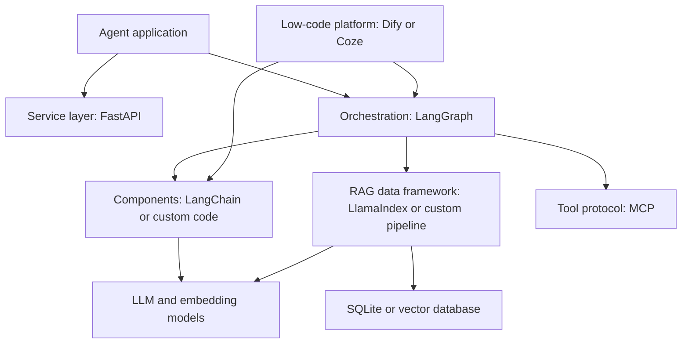
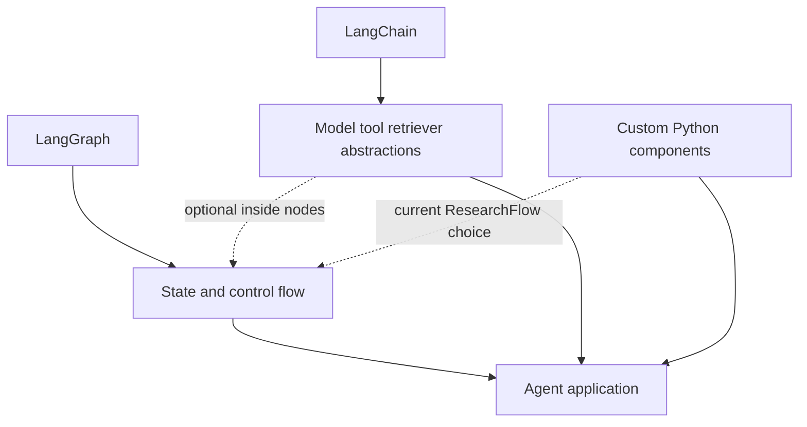
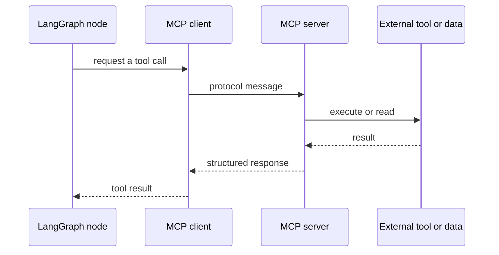
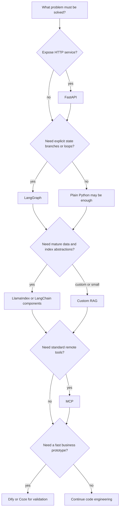

# Agent 相关框架与组件边界

目标：避免把框架、协议、模型、检索算法和低代码平台混为一谈；本文说明当前项目的组件边界与选型理由。

## 1. 先按层分类

一个产品可以同时使用多个层，不能简单问“LangGraph 和 MCP 谁更好”。它们解决的问题不同。

## 2. 核心对比

| 名称 | 类别 | 主要解决的问题 | ResearchFlow 当前使用 |
| --- | --- | --- | --- |
| FastAPI | Web/API 框架 | HTTP 边界、校验、依赖、OpenAPI | 是，直接依赖 |
| LangGraph | 状态工作流/Agent 编排 | state、node、edge、循环、持久化/HITL 能力 | 是，直接依赖 |
| LangChain | LLM 应用组件库 | model、prompt、tool、retriever、chain 等抽象 | 否，主链路使用自定义组件 |
| LlamaIndex | 数据/RAG 框架 | 文档 ingestion、index、retriever、query engine | 否，当前自研轻量链路 |
| MCP | 工具与上下文协议 | client/server 间发现和调用工具/资源 | 是，Server 暴露本地检索/引用回查；Client 调用外部网络搜索 |
| Dify/Coze | 低代码应用平台 | 快速编排、运营、发布和集成 | 否，ResearchFlow 是代码工程 |
| FastEmbed | 推理库 | CPU ONNX embedding 推理 | 是，可选 embedding backend；BGE reranker 由独立 Transformers 组件负责 |
| vLLM | LLM 推理服务/引擎 | 高吞吐模型 serving | 否，调用外部 LLM API |

## 3. LangGraph 与 LangChain

结论：LangGraph 可以在节点里使用 LangChain 组件，也可以直接调用自定义 Python。ResearchFlow 选择后者，因此无需为了“主流”强行加入 LangChain。

学习要求：

- LangGraph：能写 state、node、conditional edge、有限循环和测试；
- LangChain：知道 model/tool/retriever/runnable 等常见抽象，能阅读岗位代码；
- 不需要为了技术栈标签同时重写成两套框架。

## 4. LangGraph 与 LlamaIndex

LangGraph关注控制流；LlamaIndex更关注数据导入、索引、retrieval/query engine。复杂 Agent 可以用 LangGraph 编排，把 LlamaIndex retriever 放进 retrieve 节点。

ResearchFlow 已经有解析、分块、embedding、BM25、RRF 和引用元数据，自研实现便于学习和解释；如果要快速接入多数据源、成熟索引或复杂 query engine，才评估 LlamaIndex。

## 5. LangGraph 与 MCP

MCP 是通信协议，不是 Agent planner。

ResearchFlow 的 LangGraph 主链路在需要网络证据时会通过 MCP Client 调用外部搜索工具；同时项目提供独立 MCP Server，把本地检索、精确引用回查和文档清单开放给外部 Host。MCP 的价值是跨进程、跨 Host 的标准发现、参数 schema 和权限边界，而不是取代 LangGraph 的规则路由。

对于有 Markdown 标题层级的来源，检索层让每个 chunk 继承其最近的标题上下文；对 PDF、DOCX、TXT 则采用格式无关的段落/自然换行/句末优先分块，必要时才使用重叠滑窗。中英跨语言语义匹配应由多语种 embedding 或查询重写承担，而不是依赖某个来源的字段名或维护关键词映射表。

## 6. 代码框架与 Dify/Coze

| 维度 | 代码框架 | Dify/Coze |
| --- | --- | --- |
| 开发速度 | 初期较慢 | 原型快 |
| 控制力 | 高 | 受平台节点限制 |
| 可测试性 | 可做单元/集成/CI | 依平台导出和测试能力 |
| 可观测性 | 自己设计，灵活 | 平台内置，方便但有边界 |
| 定制与性能 | 高 | 深度定制受限 |
| 适合场景 | 核心系统、复杂逻辑、工程岗位作品 | 需求验证、运营工作流、快速客户 Demo |

你已有 Dify/Coze 原型经验，不需要否定它；ResearchFlow 的作用是补充代码级 Agent 工程证据。

## 7. 是否需要 vLLM

当前项目调用 DeepSeek-compatible API，没有在本地部署基座模型，因此 vLLM 不在运行链路中。只有自托管开源 LLM、需要 batching/KV cache/吞吐优化时才引入；应清楚区分 API provider 与 self-host serving 的边界。

## 8. 选型问题树

## 9. 当前项目的能力边界

- 当前核心：FastAPI、LangGraph、SQLite、FAISS 与自定义 RAG；
- 配套组件：Pydantic、pytest、Docker、FastEmbed、HTTPX；
- MCP：Server 提供 `search_research_documents` 与精确引用回查；Client 调用外部网络搜索；
- 相邻方案：LangChain、LlamaIndex、Dify/Coze、vLLM 用于比较与选型，不构成当前运行依赖；
- 不做：为技术栈标签把同一项目重写到多个框架。

## 10. 设计说明

> ResearchFlow 使用 FastAPI 提供 Web / REST API，以 LangGraph 显式编排状态和条件重试；SQLite 保存可追溯业务数据，FAISS 完成可重建的向量 Top-K，没有为了堆框架强依赖 LangChain。同时我实现 MCP Server 让外部 Host 复用本地检索/精确引用回查，也实现 MCP Client 调用外部网络搜索。MCP 不替代 LangGraph 的规则路由与状态控制，而是解决跨进程工具发现、输入 schema 和权限边界。Dify/Coze 适合快速原型，而这个项目重点证明代码级可测试、可部署和可观测能力。

## 官方入口

- [LangGraph documentation](https://docs.langchain.com/oss/python/langgraph/overview)
- [LangChain documentation](https://docs.langchain.com/oss/python/langchain/overview)
- [LlamaIndex documentation](https://docs.llamaindex.ai/)
- [Model Context Protocol](https://modelcontextprotocol.io/)
- [FastAPI documentation](https://fastapi.tiangolo.com/)
