# ResearchFlow 知识关系图全集

这份文档不是新的教材，而是把各手册中的知识点连接起来。图全部采用纵向或小规模布局，便于 GitHub 页面显示。每张图下面给出对应学习文档。

## 0. 知识面覆盖索引

| 知识面 | 关系图 | 主文档 |
| --- | --- | --- |
| Python、分层与类型 | 图 1、图 2 | [技术栈手册](technical-stack-handbook.md) |
| FastAPI、Pydantic、HTTP | 图 2、图 3 | [FastAPI 快速入门](quickstarts/fastapi.md) |
| LangGraph、Agent、工具 | 图 4、图 5 | [LangGraph 快速入门](quickstarts/langgraph.md) |
| RAG、BM25、Embedding、RRF | 图 6、图 7 | [技术栈手册](technical-stack-handbook.md) |
| 引用、评测、失败分析 | 图 8 | [失败案例](failure-cases-and-debugging.md) |
| SQLite、SQL、记忆、轨迹 | 图 9 | [SQLite 快速入门](quickstarts/sqlite.md) |
| LLM API、Prompt、上下文 | 图 10 | [配套栈速查](quickstarts/supporting-stack.md) |
| 测试、Docker、CI、可观测性 | 图 11 | [配套栈速查](quickstarts/supporting-stack.md) |
| 相邻 Agent 框架 | 图 12 | [框架边界](framework-boundaries.md) |
| PyTorch、Transformers、PEFT | 图 13 | [技术栈手册](technical-stack-handbook.md) |
| 两天学习依赖顺序 | 图 14 | [周末冲刺](weekend-study-guide.md) |

## 图 1：项目技术分层

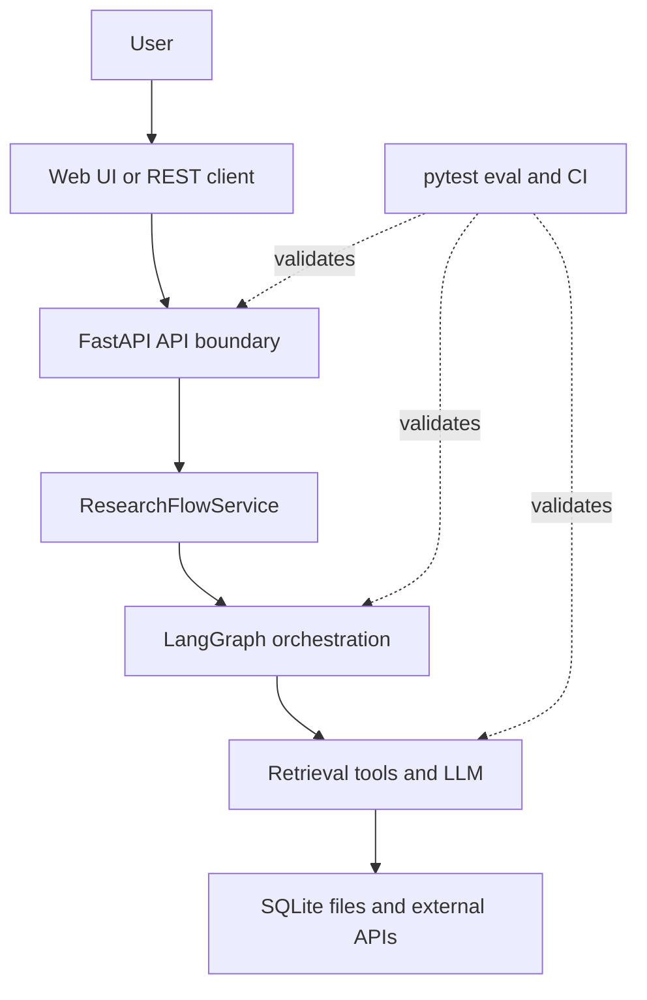

关系：上层负责业务语义，下层提供能力；测试横跨各层。不要让 FastAPI 路由直接承担所有检索和数据库逻辑。

## 图 2：Python 类型与边界

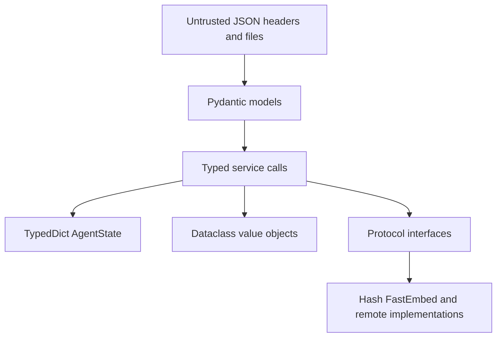

关系：Pydantic守外部边界，TypedDict描述图状态，dataclass承载内部值，Protocol隔离可替换实现。

## 图 3：FastAPI 请求生命周期

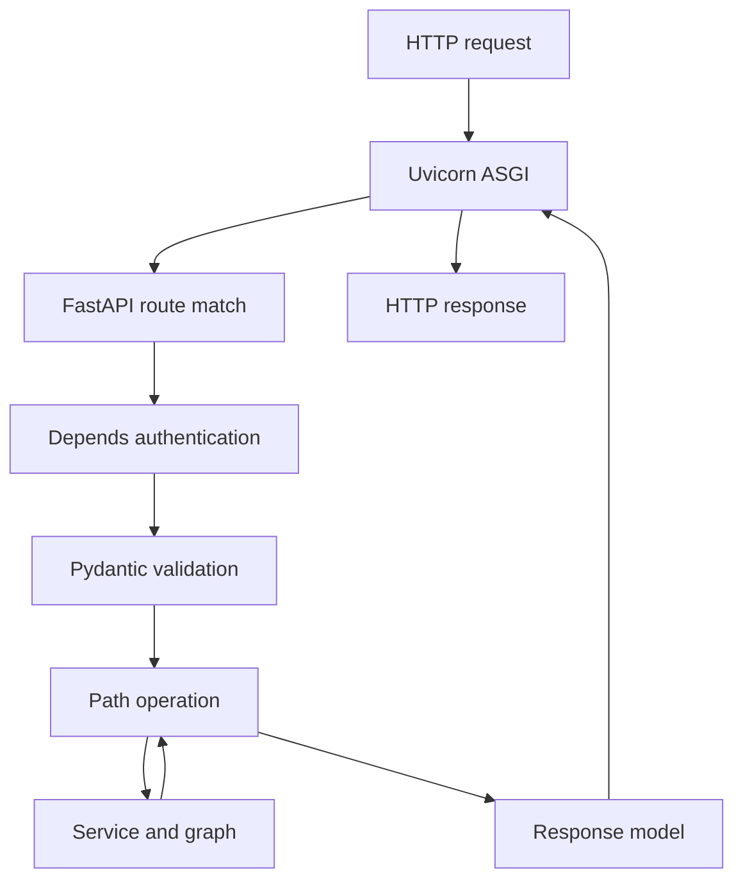

## 图 4：LangGraph 组件关系

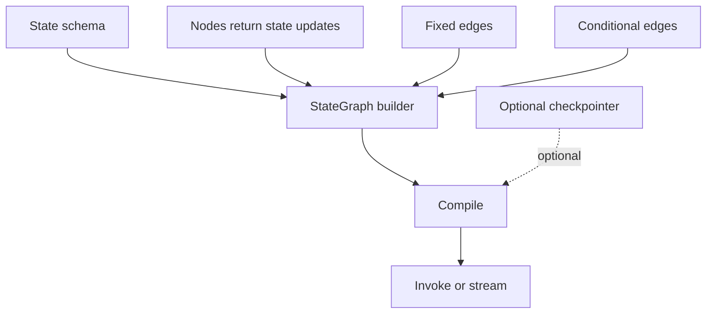

## 图 5：ResearchFlow Agent 状态流

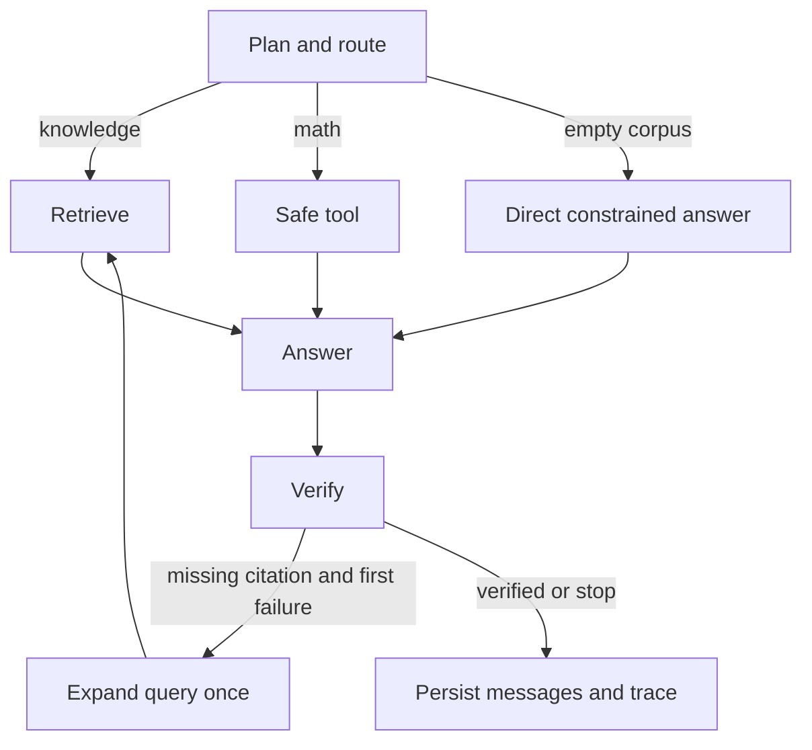

## 图 6：文档进入知识库

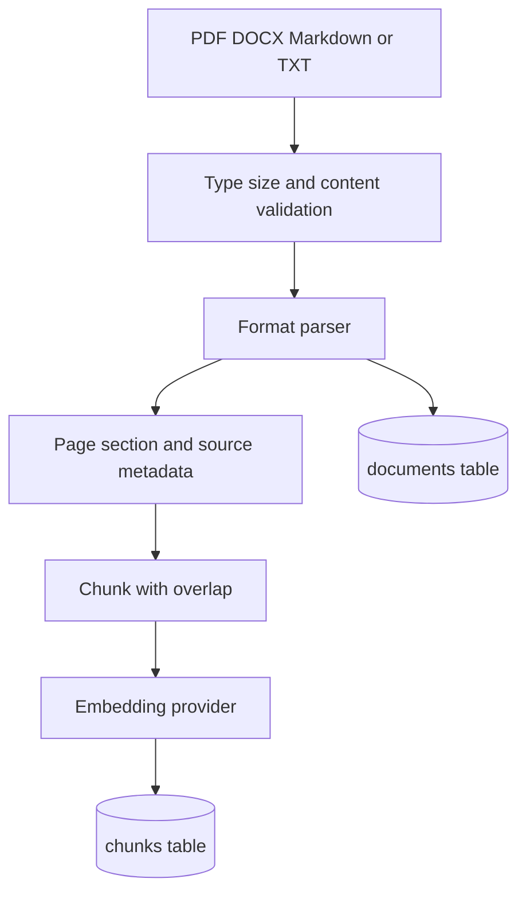

## 图 7：混合检索与融合

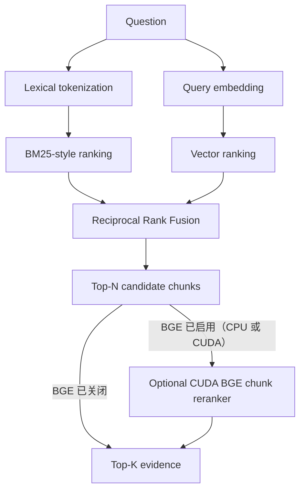

关系：BM25擅长精确术语，embedding擅长语义近似，RRF融合排名；BGE reranker 只对 Top-N 分片进行可选第二阶段重排。默认 `auto`：CUDA 自动加载；CPU 默认保留 RRF，但可从网页顶部按钮手动加载。`bge` 可按配置强制加载，`none` 强制关闭。

## 图 8：回答、引用与评测

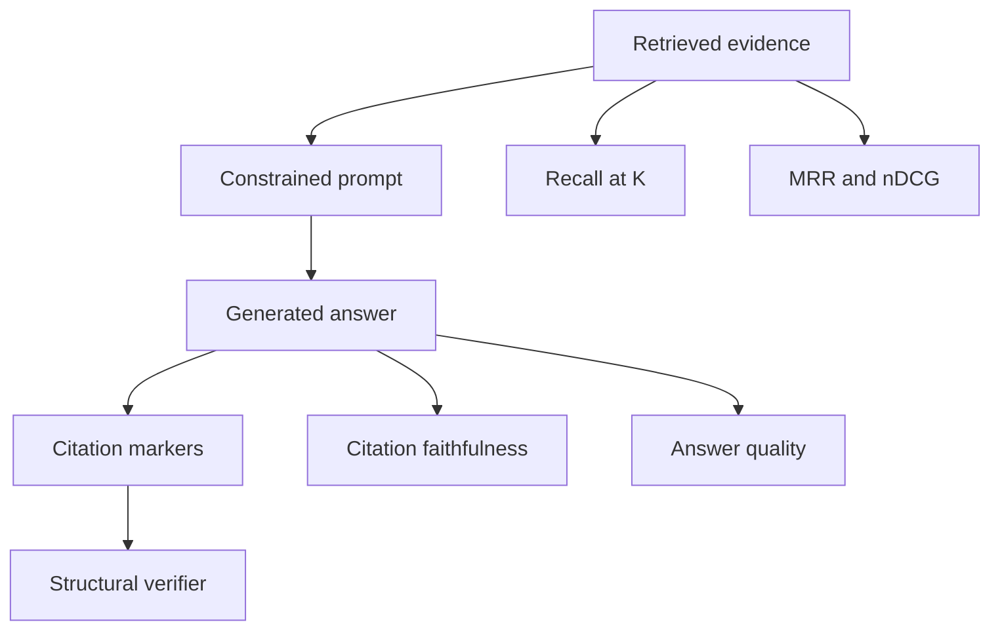

关系：当前 verifier 只检查证据存在和引用标记，不等于语义忠实度；真实评测还需要人工标注 evidence/answer。

## 图 9：SQLite 数据与事务

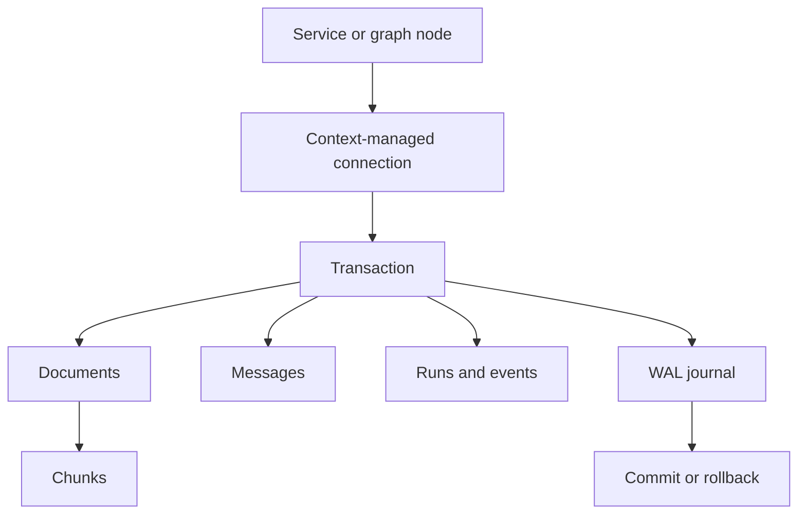

关系：消息/运行轨迹是业务持久化，不是 LangGraph checkpoint。

## 图 10：LLM、Prompt 与上下文

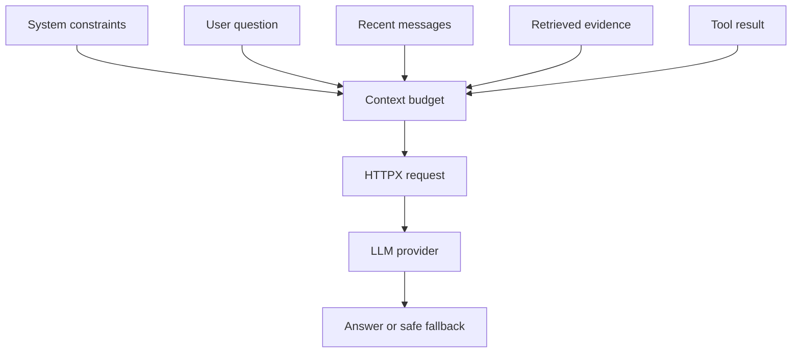

关系：上下文由多种来源竞争 token 预算；文档内容是证据，不应覆盖系统约束。

## 图 11：测试、部署与可观测闭环

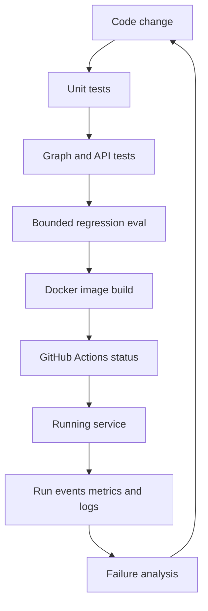

关系：CI通过说明自动检查通过，不等于生产部署或真实业务质量达标。

## 图 12：相邻框架和协议

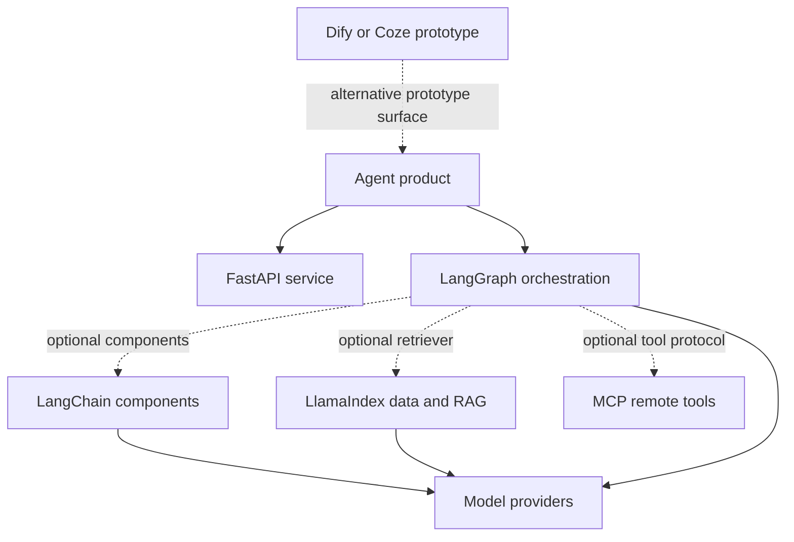

## 图 13：PyTorch、Transformers 与 PEFT 扩展知识

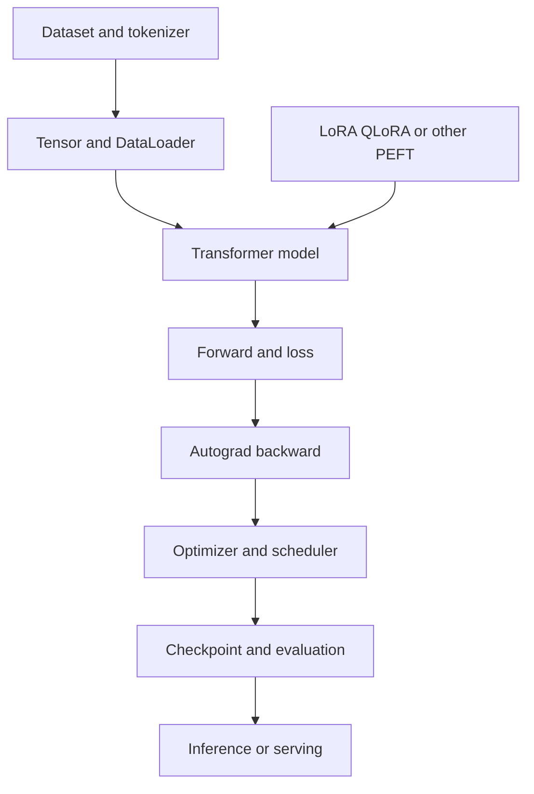

关系：这是量化/PEFT算法简历的基础，不是 ResearchFlow 运行依赖；两天项目冲刺只做概念复习。

## 图 14：两天学习依赖图

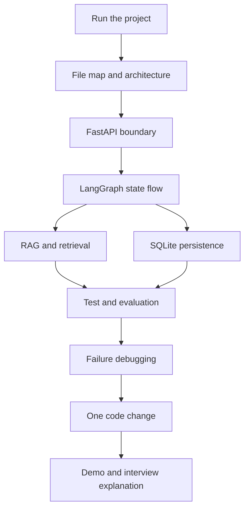

学习顺序不是按框架官网从头读，而是沿着真实请求链路逐层展开，最后用测试、故障和修改证明掌握。
