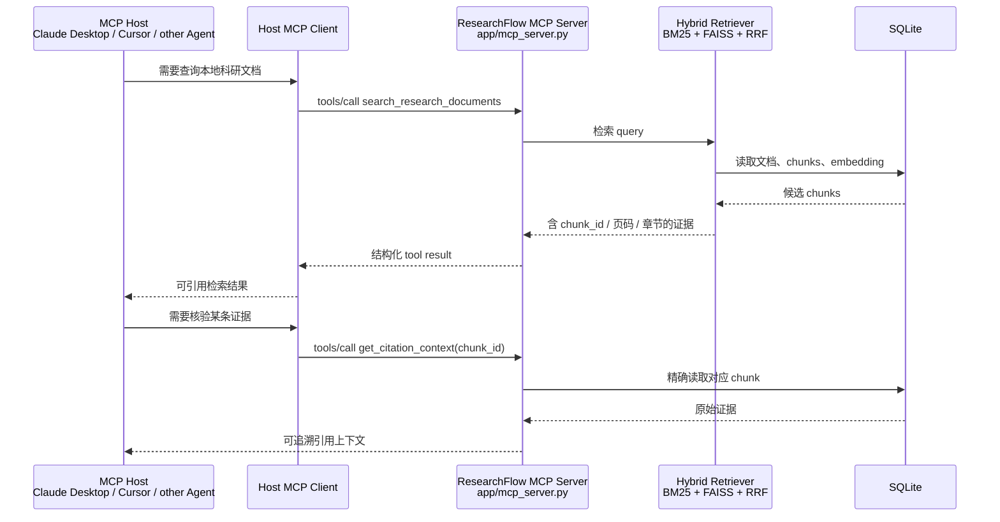

# ResearchFlow MCP 集成手册

本文说明 ResearchFlow 中 MCP 的真实作用、运行方式与代码边界。MCP 是让 Host 标准化发现和调用外部能力的协议，不是万能 Agent 框架。项目同时实现 MCP Server（向外提供本地知识库能力）与 MCP Client（调用外部网络搜索）。

## 1. 这个项目里的 MCP 做了什么



- **FastAPI**：面向浏览器、REST API 和 Web UI。
- **LangGraph**：面向 ResearchFlow 内部的状态、路由、有限重试和回答校验。
- **MCP Server**：面向外部 Agent Host，以统一协议暴露本地检索和资源。
- **MCP Client**：由 ResearchFlow 内部在网络路由时启动外部搜索 MCP Server 并调用其工具；LangGraph 只负责路由和状态流，不承担搜索协议实现。
- **SQLite / Retriever**：两种入口共享的本地数据与检索能力。

## 2. 已实现的 Tools 与 Resource

| 类型 | 名称 | 输入 | 输出 | 价值 |
| --- | --- | --- | --- | --- |
| Tool | `search_research_documents` | `query`, `top_k` | chunk ID、文档、页码、章节、分数、原文片段 | 外部 Agent 能检索本地论文并获得可追溯证据 |
| Tool | `get_citation_context` | `chunk_id` | 精确对应的原始 chunk 与 provenance | 防止再次搜索后引用换了证据 |
| Resource | `researchflow://documents` | 无 | 当前文档库存与运行指标 | 让 Host 读取稳定、只读的上下文 |

`top_k` 被限制在 1–8，避免一次工具调用把过多未筛选文档塞进上下文。`get_citation_context` 不重新检索，而是在 SQLite 中按 ID 精确读取，这是可追溯引用的关键边界。此前的示例计算工具已移除，避免把与科研文档 RAG 无关的普通计算节点包装成核心 Agent 能力。

## 3. 启动与验证

```powershell
python -m pip install -e ".[dev]"
.\.venv\Scripts\python.exe -m app.mcp_server
```

`stdio` 会把 JSON-RPC 协议写到标准输出，因此不要在同一终端期待普通日志。项目自动化验证覆盖工具注册、混合检索、按 chunk ID 回查、Resource 读取，以及独立 MCP 客户端对 `stdio` Server 的初始化、工具发现和实际调用。另有独立的网络搜索 MCP fixture，验证内部 MCP Client 的实际 stdio 握手、工具调用和结构化结果归一化：

```powershell
.\.venv\Scripts\python.exe -m pytest
```

MCP Server 读取 `RESEARCHFLOW_DB_PATH`，应与 FastAPI 服务使用同一数据路径；密钥只通过环境变量注入，不能提交 `.env`。

## 4. 桌面 Host 配置范式

不同 Host 的配置文件位置不同，但 `stdio` 配置的核心一致：让 Host 启动独立 Python 进程，并把项目目录作为工作目录。

```json
{
  "mcpServers": {
    "researchflow": {
      "command": "C:\\absolute\\path\\to\\researchflow-agent\\.venv\\Scripts\\python.exe",
      "args": ["-m", "app.mcp_server"],
      "cwd": "C:\\absolute\\path\\to\\researchflow-agent",
      "env": {
        "RESEARCHFLOW_DB_PATH": "C:\\absolute\\path\\to\\researchflow-agent\\data\\researchflow.db"
      }
    }
  }
}
```

先使用 Web UI 或 REST API 导入论文，再让 Host 连接 MCP Server。连接后，Host 应能列出两个 Tools 和一个 Resource；先调用检索工具，再使用返回的 `chunk_id` 调用 `get_citation_context` 完成一次核验。

## 5. 安全和生产边界

- `stdio` 适合本机可信 Host，不等同于公开网络服务。
- Server 当前只提供只读检索和引用读取；不通过 MCP 开放上传或删除知识库的高风险能力。
- 文档内容是**不可信数据**，不是系统指令；Host 应把检索文本作为证据，不执行其中的提示注入文字。
- 公网部署应使用 Streamable HTTP、身份认证、最小权限、审计日志、限流和超时；V1 不应宣称已实现这些生产级控制。

## 6. 常见问题

### MCP、Function Calling 和 REST API 有什么关系？

REST API 是 HTTP 风格服务接口；Function Calling 是模型输出结构化工具参数的机制；MCP 是让 Host 发现 Tools / Resources / Prompts 并标准调用它们的协议。ResearchFlow 内部仍可直接调用 Python 函数或 REST API；MCP 的价值是让外部 Host 不必为每个工具手写私有适配层。

### 为什么要同时保留 FastAPI 与 MCP？

两者服务对象不同。FastAPI 服务浏览器、前端和普通 HTTP 集成；MCP 服务支持协议的 AI Host。二者复用同一个 service/retriever，而不是把业务逻辑复制两遍。

### 为什么 `get_citation_context` 不能再次按 query 搜索？

第二次搜索可能因 query、语料或排序变化返回不同 chunk。第一次返回 `chunk_id`，第二次精确读取该 ID，才能保证最终引用对应最初被检索到的证据。

### Host、Client、Server 各是什么？

Host 是承载用户交互和模型的应用；Client 是 Host 中与一个 MCP Server 建立连接的组件；Server 暴露工具和资源。一个 Host 可以有多个 Client，并连接多个 Server。

## 7. 代码走读顺序

1. `app/mcp_server.py`：Tool / Resource 定义、输入约束和 adapter 边界；
2. `app/retrieval.py`：混合检索和 RRF；
3. `app/db.py`：`get_chunk()` 如何用 ID 保障引用可追溯；
4. `tests/test_mcp_server.py`：从 adapter 到 stdio client 的验证；
5. `app/main.py`：与 Web / REST API 的分工。

## 8. 90 秒项目表达

> ResearchFlow 是一个本地部署的科研文档 Agent。我用 FastAPI 提供 Web 和 REST API，用 LangGraph 管理本地、网络与混合来源的路由、引用校验和有限重试；文档侧采用 BM25、FAISS 向量检索与 RRF，并把页码、章节和 chunk ID 保存下来。为了让外部 AI Host 安全复用本地知识库，我实现了 MCP Server，暴露混合检索、按 chunk ID 的精确引用回查和文档 Resource；同时用 MCP Client 调用外部网络搜索，并把 URL 作为证据保存。MCP 解决跨进程工具发现和 schema 对齐，LangGraph 仍负责应用内部的状态编排。项目对两类 stdio 调用都做了端到端测试。
