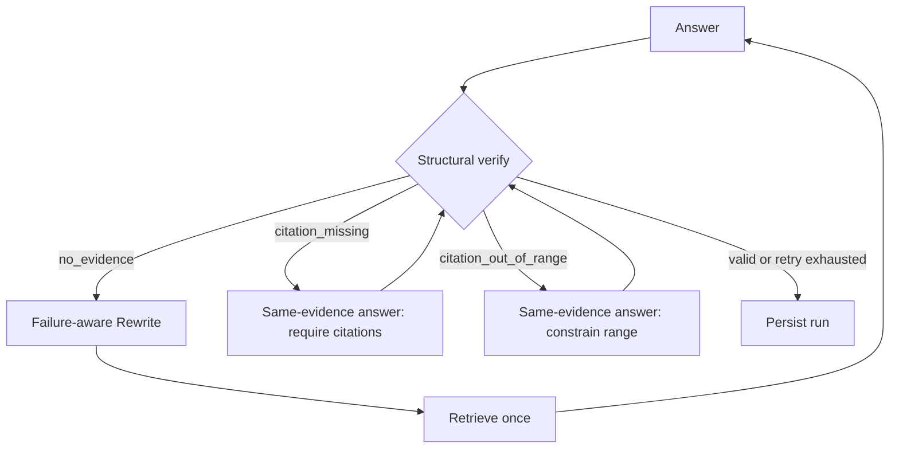

# Query Rewrite 与结构化验证

本模块把“多轮追问的检索可用性”和“引用格式是否可用”分成两个可观测、可测试的环节。它提升的是检索链路的可诊断性；**不**代表已经完成了逐句事实核验、引用忠实度判定或真实业务语料上的准确率评测。

## 会话感知 Query Rewrite

```mermaid
sequenceDiagram
    participant H as Recent verified turns
    participant Q as Current question
    participant W as Rewrite node
    participant R as Hybrid retrieval
    H->>W: Up to 3 verified user + assistant turns
    Q->>W: Current question
    W->>W: Standalone JSON query; no new facts
    W->>R: retrieval_query
```

- 只读取同一 `session_id` 中最近 **3** 个 `verified=true` 的 run，并按时间顺序提供该轮的用户问题和助手回答；单次历史上限为 **2400 个字符**。
- 助手回答只用于补全“它 / 这个方法 / 上述结果”等指代，**不是检索证据，也不是可执行指令**。真正的回答证据仍只来自本轮 `HybridRetriever.search` 返回的文档块。
- 未通过 Verify 的回答不会进入下一轮的短期记忆，避免一次无引用或异常回答污染后续检索。
- Rewrite 模型只可复用当前问题或近期对话中**明确出现的实体**；不得复制历史事实、猜测文档来源、补充数值或直接回答问题。它固定关闭 thinking，以避免短改写额外消耗推理预算。
- 正常首问且没有可信历史时，安全地保留原 Query；但若检索已经以 `no_evidence` 失败，即使没有历史，也允许模型做一次受约束的“中性同义词 / 方法词 / 任务词”扩展改写。
- 每个 run 持久化 `query`、`retrieval_query`、`rewrite_reason`，网页与 run/session API 都能回看实际检索问题及原因。

这不是关键词映射表，也不针对论文标题或 Markdown 标题做硬编码。对话上下文只解决指代；文档内容和格式仍由通用解析、切块、混合检索与 rerank（启用时）处理。

## Verify 结论与对应修复策略

| `verify_reason` | 含义 | 下一步 | 额外提示约束 |
| --- | --- | --- | --- |
| `no_evidence` | 本次检索没有返回证据块 | 带失败原因 Rewrite 后重新检索一次 | 保留已知实体和意图，只扩展中性检索表述；不添加事实 |
| `citation_missing` | 有证据块，但答案没有 `[n]` | 用**同一组证据**重新生成一次 | 每个实质性事实主张必须带有效 `[n]`；不得新增无依据主张 |
| `citation_out_of_range` | `[n]` 超出本轮证据编号范围 | 用**同一组证据**重新生成一次 | 只允许 `[1]` 到 `[N]`；不得虚构编号 |
| `citation_indices_valid` | 出现的 `[n]` 都指向本轮证据范围 | 通过结构化验证 | — |



无证据是**召回问题**，一次扩展查询后重检索可能有效；引用缺失或越界是**生成格式问题**，再次检索既不能修复 `[99]`，还会改变证据集合，所以只针对原证据重答。每条 RAG 失败路径都有一次业务重试上限；`recursion_limit=12` 是独立的图运行保护，不是业务重试次数。

## 验证的边界

`citation_indices_valid` 仅说明编号存在且没有越界；它不证明每个主张都被其引用支持，也不证明没有漏引、错引或曲解原文。要评估引用忠实度，还需要主张级拆分、NLI/LLM judge 与人工抽检等额外评测；当前版本不会把这些能力包装成已经实现。

## 可追溯性与回归测试

每个节点事件保存累计耗时 `at_ms`、节点耗时 `duration_ms` 与可读 `detail`；网页展示实际检索 Query、改写原因、验证原因、引用和完整运行轨迹。

当前 `pytest` 共 **55 项**。与本模块直接相关的回归包括：

1. 两轮会话的代词追问：第二轮收到最近的已验证用户 + 助手 turn，并持久化实际 `retrieval_query`、改写和验证原因；
2. 未通过引用验证的 run 不会进入下一轮 Rewrite 上下文；
3. `no_evidence` 会携带失败原因进行一次扩展型 Rewrite/检索，即使历史为空也不会跳过该策略；
4. `citation_missing` 与 `citation_out_of_range` 都只在同一证据上重答一次，并分别把失败原因传给生成提示词；
5. 直接调用 `LLMClient.rewrite_query` 时，验证历史的用户与助手文本会进入请求，且请求固定 `thinking=disabled`。

这些测试证明明确行为具备回归保护，不代表已经测得真实文档集上的代词消解准确率、事实正确率或召回率。
