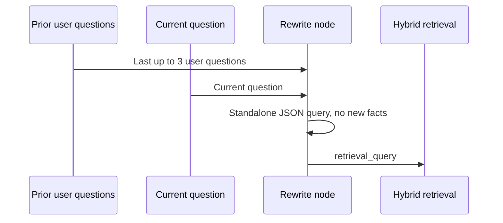
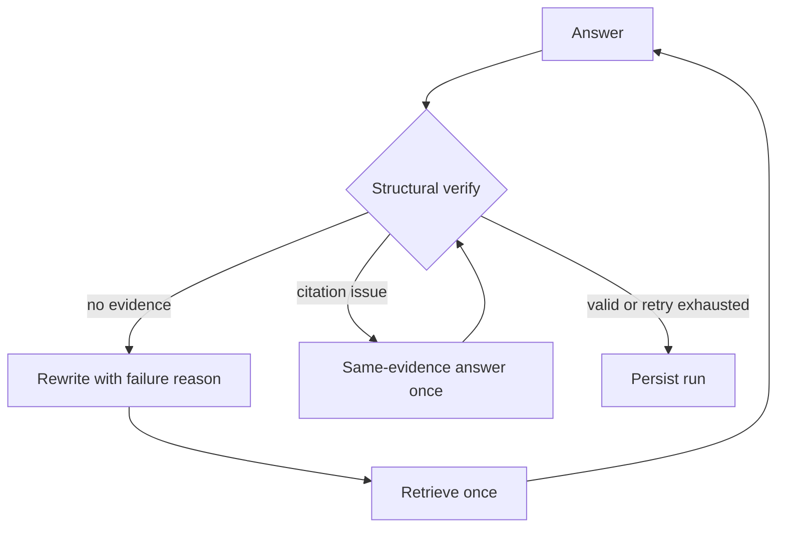

# Query Rewrite 与结构化验证

本模块把“多轮追问”和“引用是否合法”作为两个独立、可观测的环节处理。它提升的是检索链路的可用性与可诊断性；不应被表述为已经完成事实一致性或逐句忠实度验证。

## 会话感知 Query Rewrite

- 只读取同一 `session_id` 中此前的**用户问题**，不把此前模型回答当作可检索事实；
- 模型返回 `standalone_query`、`rewritten`、`reason` 三个 JSON 字段。改写调用固定关闭 thinking，避免为短改写额外消耗推理预算；
- 提示明确要求仅复用当前问题或此前用户问题中出现的实体，不编造事实，也不根据文件名猜测文档来源；
- 没有历史、未配置模型或模型格式异常时，安全回退原 Query，并留下可审计原因；
- 每个 run 都会保存 `query`、`retrieval_query`、`rewrite_reason`。网页与 run / session API 均可查看。

因此它不是硬编码的中英关键词表，也不是基于论文标题/章节的特判。缺少必要上下文时保留原问题是正确的保守行为。

## 验证器实际保证的内容

| `verify_reason` | 含义 | 最多一次的下一步 |
| --- | --- | --- |
| `no_evidence` | 本次检索没有返回证据块 | 带失败原因重写后重新检索 |
| `citation_missing` | 有证据块，但答案没有 `[n]` | 在同一证据上重新生成 |
| `citation_out_of_range` | `[n]` 超出本轮证据编号范围 | 在同一证据上重新生成 |
| `citation_indices_valid` | 所有出现的 `[n]` 都指向本轮证据列表 | 通过结构化验证 |

关键边界：`citation_indices_valid` 仅证明编号存在且不越界；它**不证明**每个主张都被证据支持，也不证明没有漏引、错引或曲解原文。真正的引用忠实度需要主张级分解、NLI/LLM judge 与人工抽检等额外评测，当前版本没有伪装成已实现能力。

## 为什么重试路径不同

无证据属于召回问题，重新检索可能有价值；引用缺失/越界属于生成格式问题，重新检索既不能修复 `[99]`，还会改变证据集合，所以只在原证据上重答。所有 RAG 失败路径都有一次业务重试上限，`recursion_limit=12` 是独立的图运行时兜底。

## 可追溯性与测试

每个节点事件保存累计耗时 `at_ms`、节点耗时 `duration_ms` 和可读 `detail`；网页展示实际检索 Query、改写原因、验证原因和完整轨迹。

当前 `pytest` 共 **52 项**，新增回归覆盖：

1. 两轮会话的代词追问：断言第二轮实际检索 Query 被改写，并且改写/验证字段持久化；
2. 回答先输出 `[99]`、重答后输出 `[1]`：断言只在同一证据上重答一次，不额外检索；
3. 显式空证据范围：断言得到 `no_evidence`，带失败原因重写并重新检索一次后停止；
4. 直接调用 `LLMClient.rewrite_query`：断言历史用户问题进入改写请求，且请求强制 `thinking=disabled`。

这些验证状态流、重试边界、持久化与 API/UI 数据契约；并不声称已经证明真实语料上的代词消解准确率或答案事实正确率。
