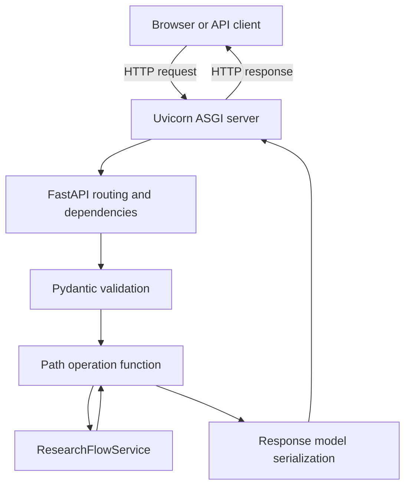
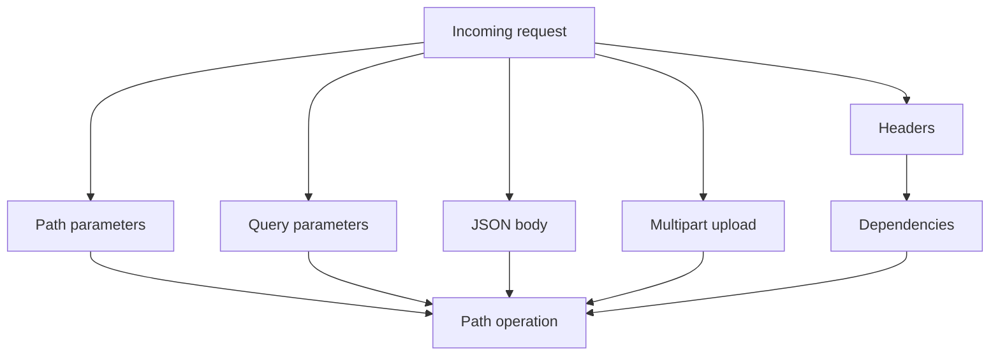
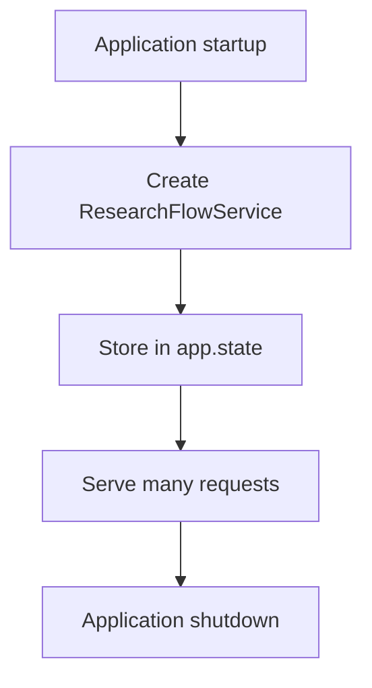

# FastAPI 快速入门：从 HTTP 请求到 Agent 服务

目标：用 60–90 分钟掌握 ResearchFlow 中真正用到的 FastAPI 核心，并能回答常见面试追问。本文以仓库当前 `fastapi>=0.115,<1.0`、Pydantic 2.x 和 Uvicorn 为背景。

## 1. 先建立心智模型

FastAPI 不是 Web 服务器本身。Uvicorn 是 ASGI Server，FastAPI 是 ASGI 应用框架，Pydantic 负责数据模型与校验。



四个关键词：

- **ASGI**：Python 异步 Web 应用与服务器之间的接口；
- **Uvicorn**：接收网络请求、调用 ASGI 应用；
- **FastAPI**：路由、依赖注入、异常转换、OpenAPI；
- **Pydantic**：把不可信输入解析并校验为明确的数据结构。

## 2. 最小可运行例子

```python
from fastapi import FastAPI
from pydantic import BaseModel, Field

app = FastAPI()

class AskRequest(BaseModel):
    query: str = Field(min_length=1, max_length=2000)

class AskResponse(BaseModel):
    answer: str
    verified: bool

@app.post("/ask", response_model=AskResponse)
def ask(payload: AskRequest):
    return {"answer": f"收到：{payload.query}", "verified": True}
```

启动：

```powershell
uvicorn app.main:app --reload
```

`app.main:app` 表示“导入 `app/main.py`，找到名为 `app` 的 ASGI 应用”。`--reload` 适合开发，不用于生产多进程部署。

## 3. 路由和参数来自哪里



- 路径：`/api/documents/{document_id}`；
- 查询参数：函数中的普通标量参数，例如上传接口的 `source`；
- 请求体：Pydantic 模型，例如 `ChatRequest`；
- Header：`Header()`，ResearchFlow 用它读取 `X-API-Key`；
- 文件：`UploadFile` + multipart；
- 共享逻辑：`Depends()`，ResearchFlow 用它复用 API Key 校验。

## 4. Pydantic 与 response_model

请求模型解决“客户端传来的数据能否进入业务层”；响应模型解决“服务承诺返回什么”。

`response_model=ChatResponse` 会用于：

- 生成 OpenAPI/Swagger 文档；
- 序列化输出；
- 验证返回结构；
- 过滤模型中没有声明的字段，减少意外数据泄漏。

边界原则：外部输入输出用 Pydantic；图内部状态可以用 `TypedDict`；纯内部值对象可用 dataclass。不要为了统一而把所有对象都改成一种类型。

## 5. 依赖注入 Depends

依赖是 FastAPI 在执行路由前替你调用的函数/对象。典型用途：鉴权、数据库连接、分页参数、共享服务。

ResearchFlow：

```python
def require_api_key(x_api_key: Annotated[str | None, Header()] = None) -> None:
    ...

@app.post("/api/chat")
def chat(payload: ChatRequest, _: None = Depends(require_api_key)):
    ...
```

高频追问：

- 为什么不是在每个路由里手写鉴权？依赖可复用、可组合，并能进入 OpenAPI 依赖结构；
- `Depends(require_api_key)` 为什么不加括号？传入的是可调用对象，由框架在请求期间调用；
- 依赖能否依赖另一个依赖？可以，会形成依赖树。

## 6. lifespan 与 app.state

模型、数据库服务和连接池不应每次请求都重新初始化。lifespan 用于应用启动与关闭阶段的资源管理。



ResearchFlow 在 lifespan 启动阶段创建一次 `ResearchFlowService`。当前对象没有需要异步关闭的资源，所以 `yield` 后没有清理逻辑；以后加入异步客户端或连接池时应在 `yield` 后关闭。

## 7. async 与 def

核心判断不是“async 更快”，而是函数是否大量等待异步 I/O。

- `async def`：适合 `await` 网络/文件 I/O；
- `def`：FastAPI 通常把同步路由放到线程池执行；
- 在 `async def` 里直接调用长时间同步 I/O/CPU 计算，仍可能阻塞事件循环；
- 不要为了形式把所有函数改成 async。

ResearchFlow 上传接口需要 `await file.read()` 和 `await file.close()`，因此使用 async；当前检索、SQLite 和 LLM 客户端主体是同步实现，普通业务路由使用 `def`。

## 8. 文件上传、安全和状态码

`UploadFile` 使用 spooled temporary file，适合文件上传，但仍必须做应用级限制。

ResearchFlow 的边界：

1. 文件名不能为空，否则 422；
2. 读取 `max_upload_bytes + 1`，只多读一个字节即可判断越界；
3. 超限返回 413；
4. 格式/解析错误返回 422；
5. `finally` 中关闭上传文件；
6. 文档内容被视为不可信证据，不是系统指令。

常见状态码：

| 状态码 | 含义 | 项目示例 |
| --- | --- | --- |
| 200 | 成功 | 查询文档、聊天、指标 |
| 204 | 成功且无响应体 | 删除文档 |
| 401 | 缺少或错误认证 | API Key 不匹配 |
| 404 | 资源不存在 | document/run 不存在 |
| 413 | 请求实体过大 | 上传超过限制 |
| 422 | 输入可解析但不满足约束 | 文件名/格式错误 |
| 500 | 服务未处理异常 | 应通过日志和测试定位 |

## 9. 错误边界

原则：只有能补充语义或转换协议的层才捕获异常。

- FastAPI 层：把业务可预期错误转换为 HTTP 状态码；
- Graph/LLM 层：模型失败转为可展示的降级回答，并只记录异常类型；
- 数据库层：异常时回滚再抛出；
- 不要 `except Exception: pass`；不要把密钥、模型完整响应或私有文档直接返回客户端。

## 10. OpenAPI、测试与调试

- `/docs`：Swagger UI，可直接调用 API；
- `/openapi.json`：机器可读 API schema；
- `TestClient(app)`：无需启动真实端口即可端到端测试路由；
- `response_model` 和 Pydantic schema 是接口契约的一部分。

最小测试思路：正常请求、字段缺失、认证失败、资源不存在、上传超限、业务异常。

```powershell
python -m pytest tests/test_api.py -vv
```

## 11. ResearchFlow 代码定位

| 知识点 | 代码 |
| --- | --- |
| app factory / lifespan | `app/main.py:create_app` |
| 依赖注入鉴权 | `app/main.py:require_api_key` |
| Pydantic schema | `app/schemas.py` |
| 文件上传 | `app/main.py:upload_document` |
| 服务边界 | `app/service.py` |
| API 端到端测试 | `tests/test_api.py` |

## 12. 高频面试题

1. **FastAPI 为什么快？** ASGI/Starlette 支持高效异步 I/O，Pydantic 提供高性能验证；实际性能仍取决于业务 I/O、模型和数据库。
2. **FastAPI 和 Uvicorn 的区别？** FastAPI 是应用框架，Uvicorn 是运行 ASGI 应用的服务器。
3. **Pydantic 有什么价值？** 在边界完成解析、校验、schema 与序列化，但不能替代业务规则。
4. **Depends 适合什么？** 跨路由共享的鉴权、资源和参数逻辑。
5. **什么时候用 async？** 调用支持 await 的 I/O；同步依赖不会因加 async 自动变非阻塞。
6. **为什么用 app factory？** 便于注入不同配置、测试隔离和多环境创建应用。
7. **为什么 `/health` 不鉴权？** 容器/负载均衡需要探活；应只暴露最小非敏感状态。
8. **如何避免上传耗尽内存？** 限制大小、流式/分块处理、限制并发、后台任务和对象存储；当前 V1 用上限加一字节检测。

## 13. 掌握验收

- 不看代码画出请求生命周期；
- 指出 Pydantic、Depends、lifespan、UploadFile 在项目中的位置；
- 解释 async/def 的选择；
- 用 `/docs` 完成一次上传和聊天；
- 给 `tests/test_api.py` 增加一个边界测试并跑通。

## 官方资料

- [FastAPI Tutorial](https://fastapi.tiangolo.com/tutorial/)
- [Dependencies](https://fastapi.tiangolo.com/tutorial/dependencies/)
- [Response Model](https://fastapi.tiangolo.com/tutorial/response-model/)
- [Request Files](https://fastapi.tiangolo.com/tutorial/request-files/)
- [Lifespan Events](https://fastapi.tiangolo.com/advanced/events/)
