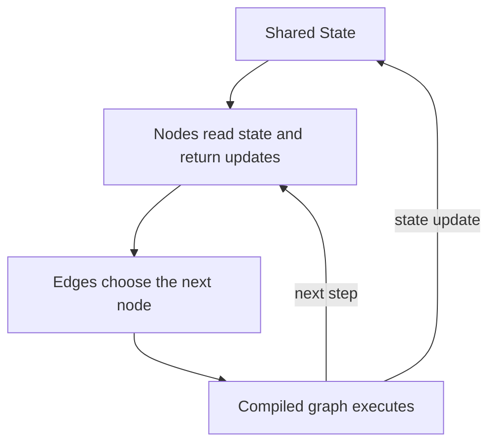
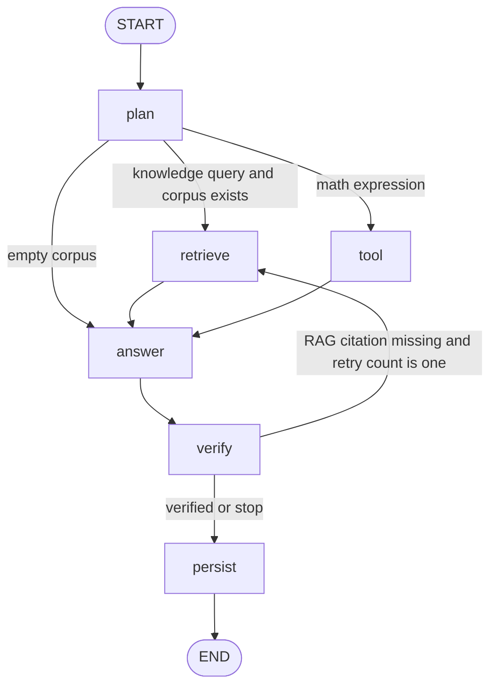
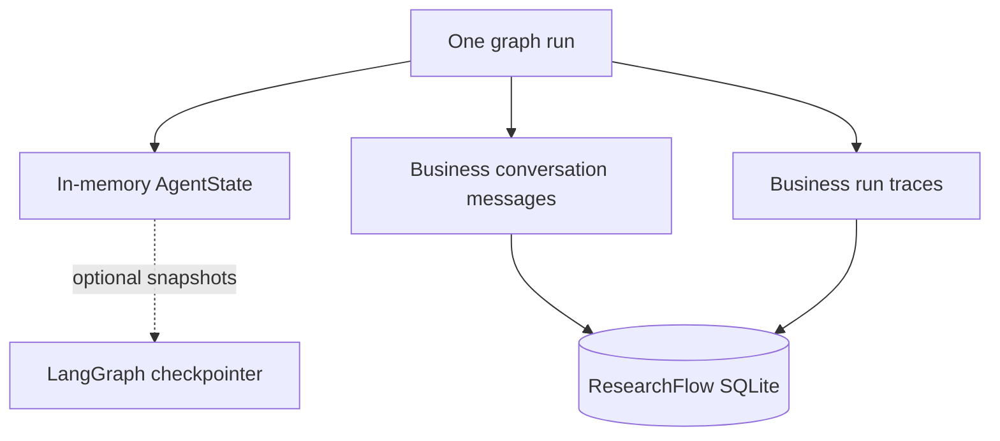
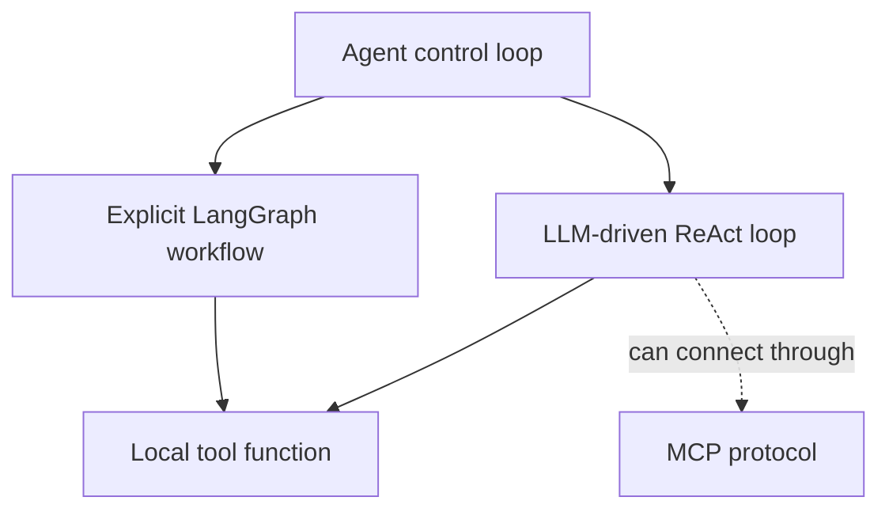

# LangGraph 快速入门：状态、节点、条件边与有限重试

目标：用 90 分钟理解 ResearchFlow 的 Agent 编排，并能在白板上解释、修改和测试。项目当前直接依赖 `langgraph>=1.0,<2.0`，不要求先学完整 LangChain。

## 1. LangGraph 解决什么问题

普通函数链适合固定顺序；Agent 工作流往往需要共享状态、条件路由、循环、失败恢复、持久化或人工中断。LangGraph 用图显式表达这些控制流。



它不是：

- 大模型本身；
- 强化学习算法；
- RAG 检索器；
- 自动保证答案正确的组件；
- 必须搭配 LangChain 才能使用的上层黑盒 Agent。

## 2. 五个核心对象

| 对象 | 含义 | ResearchFlow |
| --- | --- | --- |
| State | 节点共享的数据 schema | `AgentState(TypedDict)` |
| Node | 读取 state、返回局部更新的函数 | plan/retrieve/tool/answer/verify/persist |
| Edge | 确定固定的下一步 | retrieve → answer |
| Conditional Edge | 根据 state 动态选择下一步 | plan 路由、verify 重试 |
| Compiled Graph | 可 invoke/stream 的运行对象 | `build_graph(...).compile()` |

`START` 和 `END` 是图的入口和出口，不是业务节点。

## 3. 最小示例

```python
from typing import TypedDict
from langgraph.graph import START, END, StateGraph

class State(TypedDict):
    text: str
    route: str

def classify(state: State):
    route = "long" if len(state["text"]) > 20 else "short"
    return {"route": route}

def short_answer(state: State):
    return {"text": state["text"].upper()}

def long_answer(state: State):
    return {"text": state["text"][:20]}

def choose(state: State):
    return state["route"]

builder = StateGraph(State)
builder.add_node("classify", classify)
builder.add_node("short", short_answer)
builder.add_node("long", long_answer)
builder.add_edge(START, "classify")
builder.add_conditional_edges(
    "classify", choose, {"short": "short", "long": "long"}
)
builder.add_edge("short", END)
builder.add_edge("long", END)
graph = builder.compile()

result = graph.invoke({"text": "hello", "route": ""})
```

构建阶段定义拓扑，运行阶段 `invoke` 才真正执行节点。

## 4. State 与更新语义

节点最好返回“需要修改的字段”，而不是随意修改传入对象。默认情况下，同名字段通常被新值覆盖；如果字段需要累积，可以用 reducer 指定合并规则。

ResearchFlow 没有为 `events` 声明 reducer，因此每个节点显式返回：

```python
[*state.get("events", []), new_event]
```

高频点：

- State 是运行时数据，不等于数据库；
- State schema 不应塞入无法序列化、生命周期不清的巨型对象；
- 并行节点同时更新同一字段时必须考虑 reducer/冲突；
- Pydantic state 可校验但开销更高，TypedDict 更轻量。

## 5. ResearchFlow 的完整图



各节点职责：

- `plan`：规则路由，不是 LLM planner；
- `retrieve`：top-4 混合检索，重试时扩展 query；
- `tool`：安全数学计算；
- `answer`：读取最近 6 条消息并调用 LLM/fallback；
- `verify`：检查 RAG 引用标记、工具结果或直接回答是否存在；
- `persist`：保存消息、route、事件、错误类型和耗时。

## 6. 条件边、循环与两层上限

条件边函数只应根据 state 决定下一节点，避免藏入大量副作用。

ResearchFlow 有两层保护：

1. **业务上限**：RAG 引用不合格时只扩展 query 重试一次；
2. **运行时上限**：调用图时设置 `recursion_limit=12`，防止图拓扑或条件错误造成无界执行。

两者不能互相替代：业务上限表达产品规则；recursion limit 是最后一道运行安全保护。

## 7. invoke、stream、async

- `invoke(input, config)`：同步执行并返回最终 state；
- `stream(...)`：逐步返回节点/状态更新，适合前端进度和调试；
- `ainvoke` / `astream`：异步版本，前提是节点和依赖真正支持异步。

ResearchFlow V1 使用同步 `invoke`，网页最终展示持久化后的事件列表；尚未实现 token 或节点级实时流式输出。

## 8. 图状态、会话记忆、checkpoint 和业务数据库

这四者经常被混淆：



- 当前 `graph.compile()` **没有配置 checkpointer**；
- ResearchFlow 自己用 SQLite 保存 messages 和 runs；
- 这能保留业务历史，但不等于能从任意图节点恢复执行；
- 如需 human-in-the-loop、故障续跑、time travel，应引入 LangGraph checkpointer 和 `thread_id`，并设计其与业务表的边界。

## 9. 工具调用、ReAct 与本项目的关系

ResearchFlow 是显式工作流 Agent：route 由规则决定，工具由固定节点执行。它没有实现“LLM 不断 Thought/Action/Observation 循环”的完整 ReAct，也没有 MCP client/server 动态发现工具。



面试时应说“LangGraph 显式编排 + 规则工具路由”，不要包装成自主规划或多智能体系统。

## 10. 错误处理与可观测性

图节点至少要回答：

- 节点失败是否终止整次运行？
- 是否允许重试，最多几次？
- 重试会不会重复产生副作用？
- 哪些错误可以返回用户，哪些只记录类型？
- 如何从 run_id 找到节点轨迹？

ResearchFlow 将事件累积到 state，模型异常降级为固定回答并记录 `llm_error: ExceptionType`，最后保存到 `runs`。当前不是分布式 tracing，也没有 token/cost 指标。

## 11. 测试图，而不是只测函数

图测试重点：

1. route 是否正确；
2. 节点顺序是否符合拓扑；
3. RAG 失败是否只重试一次；
4. 最终一定到 persist；
5. 异常是否被脱敏；
6. state 必需字段是否始终存在。

```powershell
python -m pytest tests/test_graph.py -vv
```

## 12. 高频面试题

1. **为什么不用普通 if/else？** 小流程可以；当状态、分支、循环、持久化和人工中断增长时，图更可视、可测试、可演进。
2. **Node 返回完整 state 还是局部更新？** 推荐局部更新，由框架合并；累积字段明确 reducer 或自行构造。
3. **Conditional Edge 与节点内 if 的区别？** 条件边显式决定控制流，拓扑更清楚；节点内 if 更适合局部计算。
4. **recursion_limit 是重试次数吗？** 不是，它限制图执行步数；业务重试另行记录。
5. **LangGraph 自带记忆吗？** 可通过 checkpointer/store 实现相应能力，但必须显式配置并提供 thread/context；当前项目用业务 SQLite 记忆。
6. **如何避免工具重复执行？** 限制循环、记录幂等键/执行状态、区分可重试与不可重试副作用。
7. **为什么当前不用 checkpointer？** V1 执行很短，业务轨迹和消息已满足演示；需要断点续跑/HITL 时再引入，避免两套持久化边界不清。
8. **LangGraph 和 LangChain 什么关系？** LangGraph 是低层状态工作流/Agent 编排；LangChain 提供模型、工具、retriever 等组件抽象。可以组合，也可以像本项目一样主要直接用 LangGraph。

## 13. 掌握验收

- 关掉文档画出 ResearchFlow 图；
- 解释 State/Node/Edge/Conditional Edge/compile/invoke；
- 指出业务重试与 recursion limit 的区别；
- 说明当前 SQLite 轨迹为什么不是 LangGraph checkpoint；
- 增加一条 route 或 retry 测试并通过。

## 官方资料

- [LangGraph overview](https://docs.langchain.com/oss/python/langgraph/overview)
- [Graph API](https://docs.langchain.com/oss/python/langgraph/graph-api)
- [Use the Graph API](https://docs.langchain.com/oss/python/langgraph/use-graph-api)
- [Persistence](https://docs.langchain.com/oss/python/langgraph/persistence)
