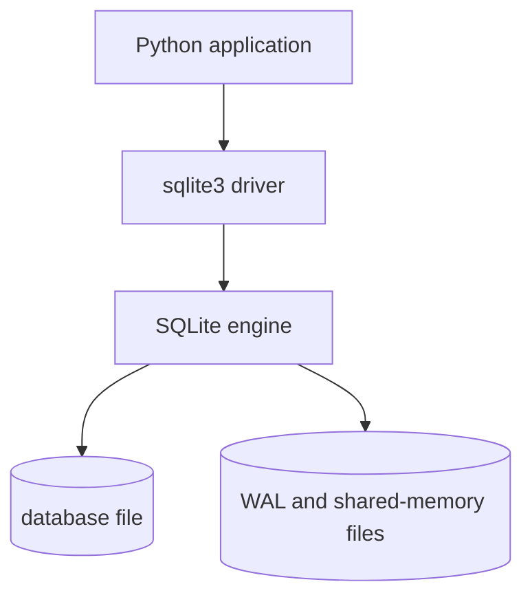
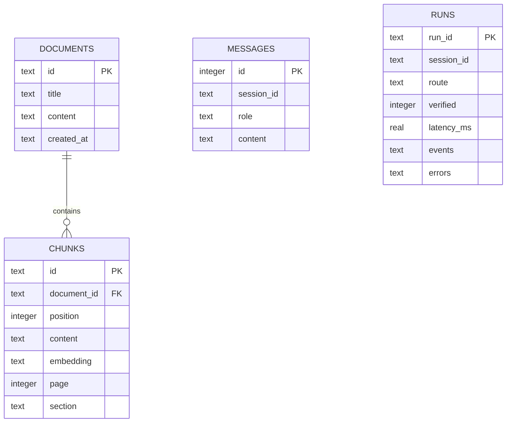
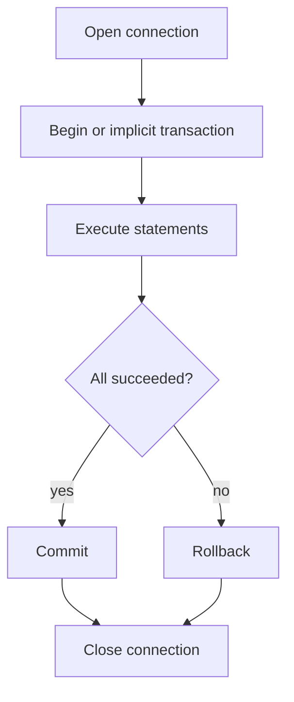
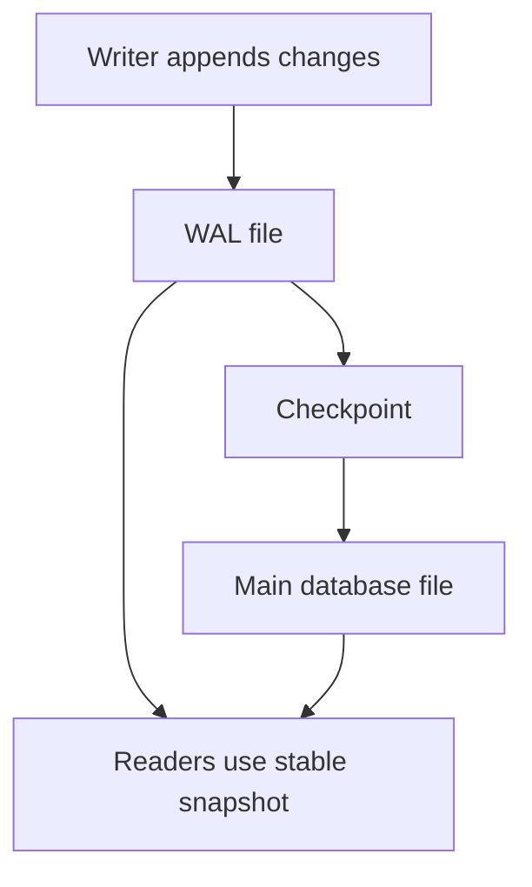

# SQLite 快速入门：事务、索引、WAL 与 Agent 持久化

目标：用 60–90 分钟掌握 ResearchFlow 使用 SQLite 的核心，能读懂 `app/db.py`、解释并发边界并完成常见排错。

## 1. SQLite 是什么

SQLite 是嵌入式关系数据库：应用通过库直接读写一个数据库文件，不需要独立数据库服务器。



适合：本地工具、单机服务、原型、小中规模读多写少数据、测试。需要大量并发写、跨机器高可用、复杂权限治理时通常考虑 PostgreSQL 等服务端数据库。

## 2. Python sqlite3 最小例子

```python
import sqlite3

conn = sqlite3.connect("example.db")
conn.row_factory = sqlite3.Row
conn.execute("PRAGMA foreign_keys=ON")

try:
    conn.execute(
        "INSERT INTO documents(id, title) VALUES (?, ?)",
        ("doc_1", "Paper"),
    )
    conn.commit()
except Exception:
    conn.rollback()
    raise
finally:
    conn.close()
```

必须掌握：连接、执行参数化 SQL、事务提交/回滚、关闭资源、把 row 转换为字典。

## 3. 关系模型：表、行、列、主键、外键、索引



- 主键：唯一标识一行；
- 外键：保持表间引用完整性；
- `ON DELETE CASCADE`：删除 document 时自动删除 chunks；
- 索引：用额外空间加速过滤、连接和排序，不是越多越好。

ResearchFlow 通过 `sessions` 主表保存会话元数据；`messages` 与 `runs` 使用 `session_id` 形成业务关联。`runs` 还持久化每轮回答的 citations、thinking mode、事件与错误，供网页在刷新后恢复完整 turn。V1 仍未把这些业务表当作 LangGraph checkpoint，不能从任意 graph super-step 恢复。

## 4. CRUD 与高频 SQL

```sql
-- Create
INSERT INTO messages(session_id, role, content) VALUES (?, ?, ?);

-- Read
SELECT role, content
FROM messages
WHERE session_id = ?
ORDER BY id DESC
LIMIT ?;

-- Update
UPDATE documents SET title = ? WHERE id = ?;

-- Delete
DELETE FROM documents WHERE id = ?;

-- Aggregate
SELECT COUNT(*) AS runs,
       AVG(latency_ms) AS average_latency,
       AVG(verified) AS verified_rate
FROM runs;

-- Join
SELECT c.content, d.title
FROM chunks c
JOIN documents d ON d.id = c.document_id;
```

SQL 执行逻辑顺序可用 `FROM/JOIN -> WHERE -> GROUP BY -> HAVING -> SELECT -> ORDER BY -> LIMIT` 理解，虽然书写顺序不同。

## 5. 参数化查询与 SQL 注入

永远不要把用户输入用字符串拼接进 SQL：

```python
# 错误
conn.execute(f"SELECT * FROM runs WHERE run_id = '{run_id}'")

# 正确
conn.execute("SELECT * FROM runs WHERE run_id = ?", (run_id,))
```

参数化只适用于值，不能直接替代动态表名/列名。动态标识符必须使用白名单。

## 6. 事务与 ACID

- **Atomicity**：一组写操作全部成功或全部回滚；
- **Consistency**：约束使数据库从一个合法状态进入另一个合法状态；
- **Isolation**：并发事务互相隔离；
- **Durability**：提交后的数据在故障后仍应保存，具体保证受 journal/synchronous 等配置影响。



ResearchFlow 的 `Database.connect()` 是 context manager：正常离开 `with` 时 commit；异常时 rollback；最后 close。

高频点：SQLite 可以同时有多个读事务，但同一时刻只有一个写事务。长事务会增加锁竞争；不要在事务中等待 LLM 或网络调用。

## 7. WAL 模式

默认 rollback journal 在修改数据库前保存旧页；WAL 把新变更追加到 `-wal` 文件，之后 checkpoint 回主数据库。



优势：读写可以并行，写入通常更顺序。边界：仍只有一个 writer；依赖同机共享内存，不适合把 WAL 数据库放在网络文件系统上；长读事务可能阻碍 checkpoint。

ResearchFlow 每次连接执行：

```sql
PRAGMA journal_mode=WAL;
PRAGMA foreign_keys=ON;
```

## 8. 外键为什么每个连接都要开启

SQLite 的外键约束需要对连接启用。只在建表时写 `FOREIGN KEY`，如果连接没有启用 `PRAGMA foreign_keys=ON`，约束可能不生效。

验证：

```sql
PRAGMA foreign_keys;
PRAGMA foreign_key_check;
```

## 9. 索引、查询计划与性能

ResearchFlow：

- `idx_chunks_document(document_id)`：加速 document 与 chunks 关联/删除；
- `idx_messages_session(session_id, id)`：加速按 session 获取最近消息。

索引适合高频 WHERE/JOIN/ORDER BY 列；代价是占用磁盘并降低写入速度。

```sql
EXPLAIN QUERY PLAN
SELECT role, content
FROM messages
WHERE session_id = ?
ORDER BY id DESC
LIMIT 6;
```

不要凭感觉加索引；结合查询计划、数据规模和延迟测量。

## 10. JSON 字段与向量存储边界

ResearchFlow 把 embedding、events 和 errors 序列化为 JSON 文本。这使 V1 简单、可移植，但检索时要把所有 chunk 读入应用内并逐个比较。

适用：小规模本地知识库、演示和可复现测试。语料增长后应考虑：

- 专用向量索引/数据库；
- embedding 独立表或二进制格式；
- 分页和批量读取；
- 后台导入任务；
- 数据保留和清理策略。

## 11. schema 迁移

当前 `_ensure_column()` 通过 `PRAGMA table_info` 检查列并执行 `ALTER TABLE ADD COLUMN`，适合 V1 向后兼容，不是完整迁移系统。

完整迁移需要：版本号、顺序脚本、失败回滚、数据回填、兼容窗口和生产备份。迁移到 SQLAlchemy/Alembic 是可能方案，但不是当前项目已实现能力。

## 12. 常见故障排查

| 症状 | 可能原因 | 检查 |
| --- | --- | --- |
| `database is locked` | 长写事务、并发写、连接未关闭 | 缩短事务，确认 timeout/close，定位 writer |
| 删除文档后 chunks 仍存在 | 外键未开启或历史脏数据 | `PRAGMA foreign_keys` / `foreign_key_check` |
| WAL 文件持续增长 | 长读事务或 checkpoint 受阻 | 检查连接生命周期和 checkpoint |
| 查询越来越慢 | 全表扫描、数据量增长、缺索引 | `EXPLAIN QUERY PLAN`、统计行数 |
| JSON 解析异常 | 部分写入/旧 schema/手工修改 | 检查原始字段和事务边界 |
| 测试相互污染 | 共用数据库文件 | 每个测试使用临时路径/独立 app |

## 13. 高频面试题

1. **SQLite 与 PostgreSQL 的区别？** SQLite 是嵌入式文件数据库、部署简单；PostgreSQL 是服务端数据库，更适合高并发、多用户、权限和扩展。
2. **WAL 是否支持多个 writer？** 不支持；它改善 reader/writer 并行，但仍只有一个 writer。
3. **为什么需要事务？** 保证一组相关写入的原子性与失败回滚。
4. **为什么用参数化 SQL？** 分离 SQL 结构和值，防止注入并改善语句复用。
5. **索引为什么不是越多越好？** 占空间，写入时要维护，低选择性索引可能无收益。
6. **外键有什么价值？** 防止孤儿数据，表达引用完整性；SQLite 连接需显式启用。
7. **为什么 embedding 不应长期 JSON 全表扫描？** 计算和 I/O 随 chunk 数线性增长，无法利用 ANN 索引。
8. **当前 SQLite 消息是不是 LangGraph checkpoint？** 不是，它是业务会话和运行轨迹，不能直接从任意 graph super-step 恢复。

## 14. 掌握验收

- 画出四张表和 document/chunk 关系；
- 解释 context manager 如何 commit/rollback；
- 解释 WAL 的读写并发与单 writer 边界；
- 用参数化 SQL 查询某个 run 和最近 6 条消息；
- 运行 `EXPLAIN QUERY PLAN` 并说出命中的索引；
- 删除文档并验证 chunks 被级联删除。

## 官方资料

- [SQLite Transactions](https://www.sqlite.org/lang_transaction.html)
- [Write-Ahead Logging](https://www.sqlite.org/wal.html)
- [Foreign Key Support](https://www.sqlite.org/foreignkeys.html)
- [Query Planning](https://www.sqlite.org/queryplanner.html)
