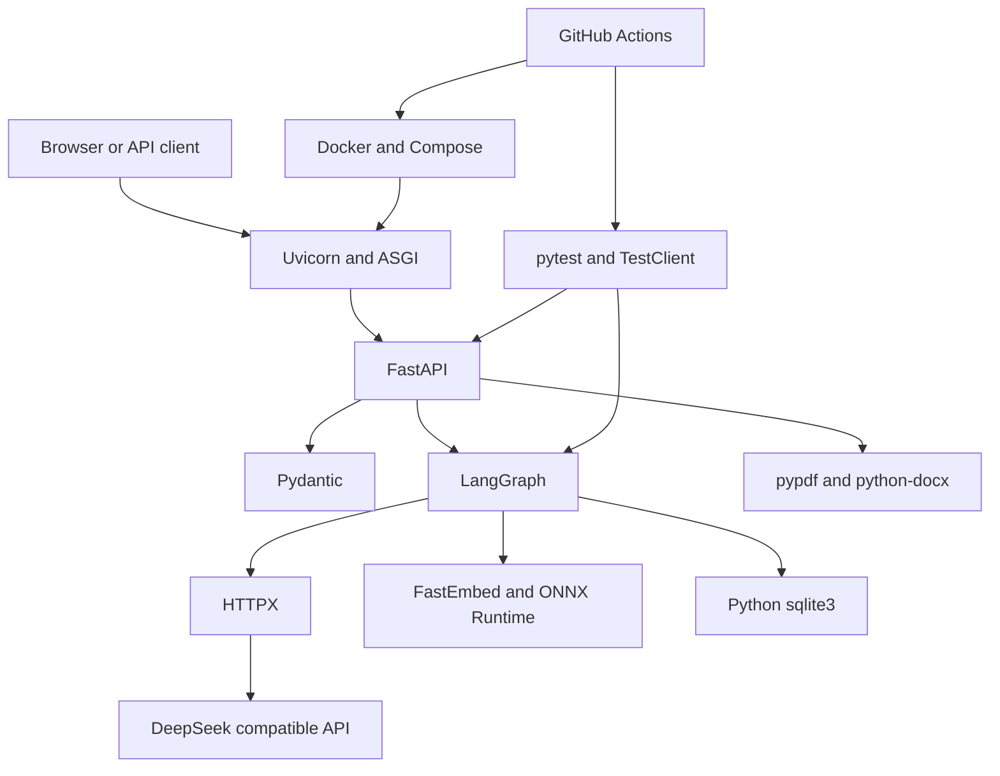
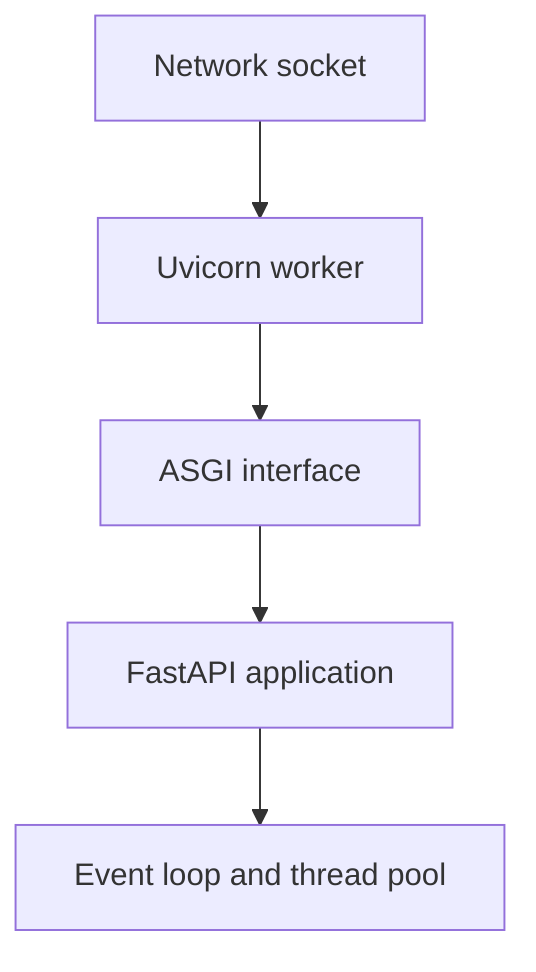
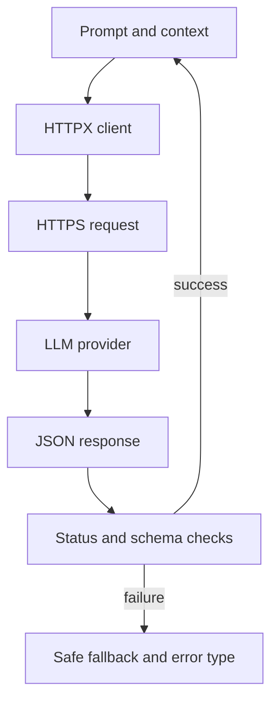
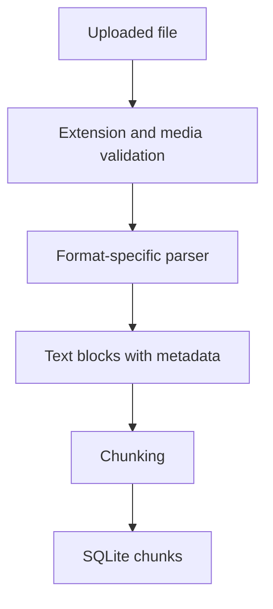
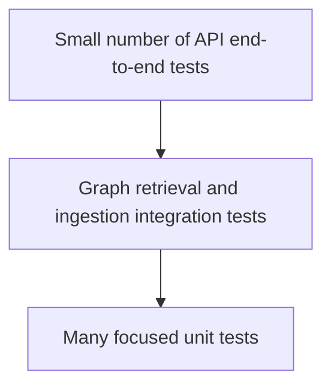
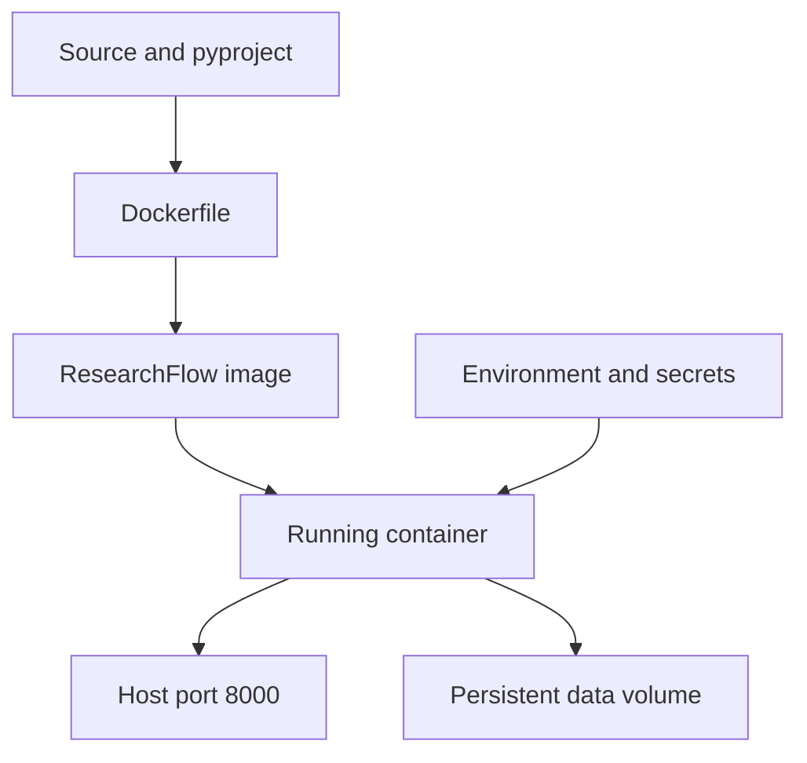
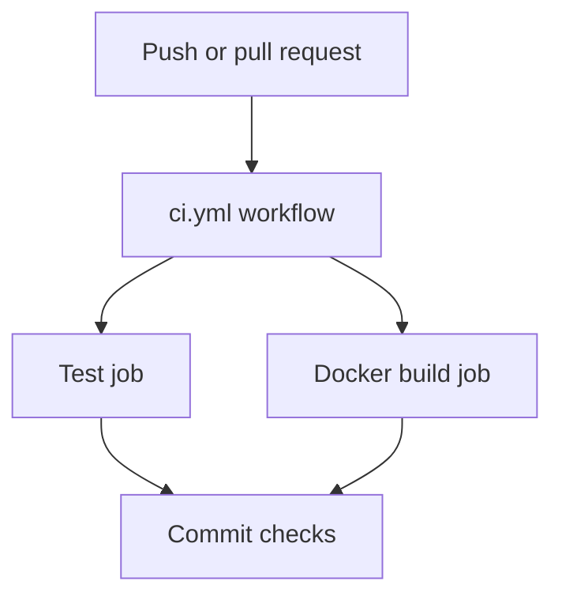

# ResearchFlow 配套技术栈快速入门

目标：两小时内建立 Pydantic、Uvicorn/ASGI、HTTPX、FastEmbed/ONNX、文档解析、pytest、Docker Compose 和 GitHub Actions 的最小完整认识。它们不需要像 FastAPI/LangGraph/RAG 主链路一样逐行精读，但面试时必须知道各自位于哪一层、解决什么问题。

## 1. 配套栈全景

## 2. Pydantic 2.x

### 核心

- `BaseModel`：声明数据结构；
- 类型注解：完成解析和校验；
- `Field`：长度、范围、描述和默认值等约束；
- `model_validate`：从原始对象验证；
- `model_dump`：导出 Python 数据；
- JSON Schema：被 FastAPI 用于 OpenAPI；
- validator：处理跨字段或自定义规则，但不要把所有业务逻辑塞进 schema。

### 与其他数据结构的边界

| 类型 | 适用位置 |
| --- | --- |
| Pydantic BaseModel | API 输入输出和不可信数据边界 |
| dataclass | 纯内部值对象 |
| TypedDict | 静态描述 dict 形状，如 LangGraph State |
| Protocol | 可替换组件接口，如 embedding provider |

### 高频问题

- Pydantic 是类型提示吗？不只是，它执行运行时解析/校验并生成 schema；
- Pydantic 能保证业务正确吗？不能，它只能保证结构与声明的约束；
- 请求校验失败为什么常见为 422？HTTP 请求格式成立，但字段不符合应用 schema。

项目位置：`app/schemas.py`。

## 3. Uvicorn 与 ASGI

### 核心

WSGI 面向传统同步 Python Web；ASGI 支持异步连接、WebSocket 和 lifespan。Uvicorn 监听端口，把请求转换成 ASGI scope/receive/send 调用 FastAPI。

高频参数：

- `--reload`：开发热重载；
- `--host 0.0.0.0`：容器内对外监听；
- `--port 8000`：端口；
- worker 数量：多进程扩展，但每个 worker 可能各自加载模型/占用内存。

高频问题：为什么不能在生产用 reload？它引入文件监控和额外进程，不是稳定的生产部署模式。

## 4. HTTPX 与 LLM API

HTTPX 是 Python HTTP client，提供同步/异步 API。ResearchFlow 用同步 client 调用 OpenAI-compatible Chat Completions 接口。

必须掌握：

- URL、method、headers、JSON body；
- connect/read/write/pool timeout；
- 非 2xx 响应与 `raise_for_status()`；
- 重试只适用于部分瞬时错误，POST 重试要考虑幂等性；
- 不记录 Authorization header、完整私有 prompt 或 provider 原始响应；
- 连接复用：频繁请求时复用 Client，而不是每次新建底层连接。

项目位置：`app/llm.py`。

## 5. python-dotenv 与配置

`.env` 只适合本地开发便利，不是秘密管理系统。

配置优先级应明确：代码默认值 < `.env` < 操作系统/容器环境变量。生产中通常由部署平台注入 secret。

必须做到：

- `.env` 加入 `.gitignore` 和 `.dockerignore`；
- 仓库只提交 `.env.example`；
- 启动时校验必要配置；
- 日志中不打印 token；
- 测试隔离环境变量，结束后恢复。

项目位置：`app/config.py`、`.env.example`。

## 6. pypdf、python-docx 与文档解析

它们负责从文件格式中提取可检索文本，不负责 OCR、版面理解或图表语义。

- pypdf：读取 PDF 文本层和页码；扫描 PDF 可能几乎无文本；
- python-docx：读取段落/表格等 DOCX 结构；复杂布局仍会丢失；
- Markdown/TXT：编码、标题层级和空内容需要验证；
- 解析后必须保留 source、filename、page/section 等引用元数据。

项目位置：`app/ingestion.py`。

## 7. FastEmbed 与 ONNX Runtime

FastEmbed 封装轻量 embedding/reranking 模型推理，通常通过 ONNX Runtime 在 CPU 上运行。ResearchFlow 可选 `BAAI/bge-small-zh-v1.5`，不要求本地 GPU。

必须掌握：

- embedding 把文本映射到稠密向量；
- query 和 document 必须使用兼容模型/编码方式；
- 相似度取决于归一化和 distance 定义；
- 批处理可显著改善吞吐；
- 首次使用要下载模型，需要缓存与离线部署策略；
- 模型维度变更后旧向量需要重建。

项目位置：`app/retrieval.py`。当前 hash provider 用于离线确定性测试，FastEmbed 用于 CPU 语义检索。

## 8. pytest 与 FastAPI TestClient

测试金字塔：

核心概念：

- Arrange / Act / Assert；
- fixture：共享可复用测试准备；
- monkeypatch：替换环境变量或依赖；
- 临时目录：隔离 SQLite 和文件；
- fake/stub：让 LLM 和 embedding 测试确定、快速；
- regression test：锁定已修复行为；
- 测试通过只证明覆盖的承诺，不证明真实业务准确率。

项目位置：`tests/`；运行 `python -m pytest -vv`。

## 9. Docker 与 Compose

Docker image 是不可变构建产物，container 是 image 的运行实例，volume 保存容器生命周期之外的数据。Compose 声明本地多服务/配置组合。

高频点：

- layer cache：先复制依赖声明再复制频繁变化源码可提高缓存命中；
- `.dockerignore`：减少上下文并避免密钥/数据库进入镜像；
- volume 与 bind mount 区别；
- 容器内 `127.0.0.1` 只代表容器自身，服务通常监听 `0.0.0.0`；
- image 不应内置 `.env`、真实数据库和模型私有缓存；
- healthcheck 与应用 `/health` 对应。

项目位置：`Dockerfile`、`compose.yaml`、`.dockerignore`。

## 10. GitHub Actions

GitHub Actions 用 workflow/job/step 组织 CI。ResearchFlow 在 push/PR 时测试并构建镜像。

CI 不是 CD：构建通过不代表已经部署。不要在 PR 工作流中打印 secret；第三方 action 尽量固定可信版本。

项目位置：`.github/workflows/ci.yml`。

## 11. 两天学习优先级

| 级别 | 内容 | 目标 |
| --- | --- | --- |
| P0 | Pydantic、pytest/TestClient | 能读 schema、补边界测试 |
| P1 | Uvicorn/ASGI、HTTPX、FastEmbed、文档解析 | 能解释位置、失败方式和配置 |
| P1 | Docker/Compose、GitHub Actions | 能启动、读配置、解释 CI |
| P2 | 深入 ONNX 优化、多 worker 调优、完整 secret 平台 | 投递后按岗位补 |

## 12. 总体验收

- 能从浏览器画到 Uvicorn、FastAPI、LangGraph、SQLite/LLM；
- 能说明每个依赖为什么存在以及替换边界；
- 能解释 FastEmbed 为什么不要求 GPU；
- 能用 pytest 复现一个失败；
- 能用 Docker Compose 启动并解释 volume、port、env；
- 能说明 GitHub Actions 当前做了 CI，没有做线上部署。
